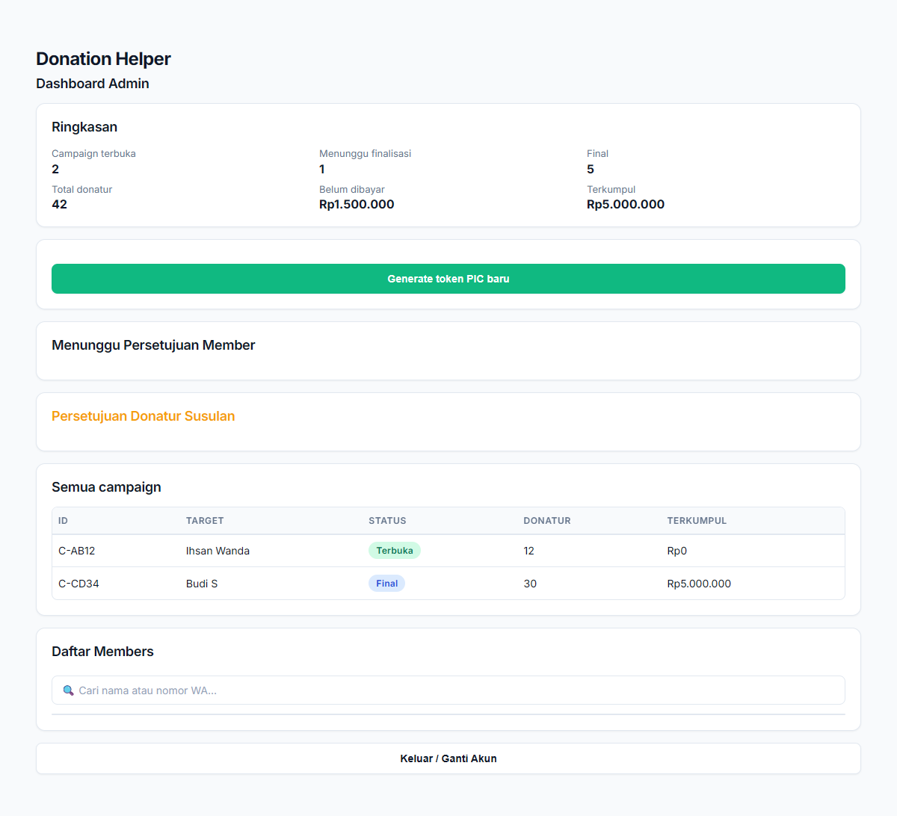

# Panduan Lengkap Dashboard Admin

Halo Admin! Panduan ini dirancang untuk membantu Anda mengelola jalannya aplikasi Donatur Helper sehari-hari. Sebagai Admin, tugas utama Anda adalah memastikan proses pendaftaran pengguna berjalan lancar dan mengelola akses bagi para PIC kegiatan.

Semua tugas ini dapat Anda lakukan dengan mudah melalui antarmuka (UI) Dashboard Admin, tanpa perlu menyentuh kode pemrograman atau masuk ke dalam *database*.

---

## 1. Memantau Ringkasan & Daftar Campaign

Saat Anda masuk menggunakan Token Admin, halaman pertama yang Anda lihat adalah **Ringkasan** dan **Daftar Campaign**.
* **Ringkasan**: Memberikan gambaran cepat mengenai berapa banyak kegiatan donasi yang sedang terbuka, berapa yang sudah selesai, total dana yang terkumpul, serta jumlah pengguna aktif.
* **Semua Campaign**: Menampilkan daftar seluruh kegiatan donasi yang dibuat oleh PIC. Anda bisa memantau status masing-masing kegiatan secara *real-time*.

---

## 2. Mengelola Akses PIC (Person In Charge)

Hanya Admin yang berhak memberikan akses kepada seseorang untuk menjadi PIC kegiatan donasi.

### Cara Membuat Token PIC Baru:
1. Gulir ke bagian **Generate token PIC baru**.
2. Klik tombol **"Generate token PIC baru"**.
3. Sistem akan memunculkan sebuah kode unik (contoh: `PIC-XYZ123`). 
4. Salin (copy) kode tersebut dan berikan kepada rekan yang ditunjuk sebagai PIC. 
5. Token ini hanya bisa digunakan satu kali untuk membuat satu *campaign* donasi.

---

## 3. Persetujuan Pengguna (Member)

Untuk menjaga keamanan, aplikasi ini menerapkan sistem persetujuan pendaftaran. Setiap pengguna baru yang mendaftar via WhatsApp tidak bisa langsung masuk ke dalam aplikasi sampai Anda menyetujuinya.

### Cara Menyetujui Pendaftar Baru:
1. Periksa bagian **"Menunggu Persetujuan Member"**.
2. Di sini akan tampil daftar rekan-rekan yang baru saja mendaftar.
3. Pastikan nama dan nomor WhatsApp mereka sudah benar dan merupakan rekan satu perusahaan.
4. Klik **Approve** (Setujui). Setelah disetujui, mereka dapat langsung mengakses aplikasi menggunakan nomor WhatsApp mereka.

---

## 4. Mengelola Daftar Pengguna (Members)

Di bagian paling bawah dashboard, Anda akan menemukan tabel **Daftar Members**.
* Anda dapat menggunakan kolom pencarian (**Cari nama atau nomor WA...**) untuk menemukan data pengguna tertentu secara cepat.
* Fitur ini sangat berguna jika ada donatur yang melapor bahwa mereka tidak bisa masuk ke dalam aplikasi. Anda dapat mengecek apakah status mereka sudah aktif atau masih *pending*.

---

## 5. Solusi Kendala Umum (Troubleshooting)

Sebagai Admin, Anda mungkin menerima pertanyaan atau laporan kendala dari User maupun PIC. Berikut adalah cara mudah mengatasinya:

* **PIC Tidak Bisa Membuat Campaign**: Pastikan token yang mereka gunakan belum kedaluwarsa atau belum dipakai sebelumnya. Jika ragu, Anda cukup membuatkan (*generate*) token PIC yang baru.
* **Pengguna Tidak Bisa Login**: Kemungkinan nomor WhatsApp mereka salah ketik saat mendaftar, atau pendaftaran mereka belum Anda *Approve* di bagian "Menunggu Persetujuan Member". Cek tabel Daftar Members untuk memastikan.
* **Tampilan Error atau Tombol Tidak Merespons**: Sarankan pengguna untuk memuat ulang (*refresh*) halaman browser mereka. 

Jika kendala masih berlanjut atau ada masalah teknis yang lebih dalam, Anda dapat meneruskannya kepada tim Superadmin.
