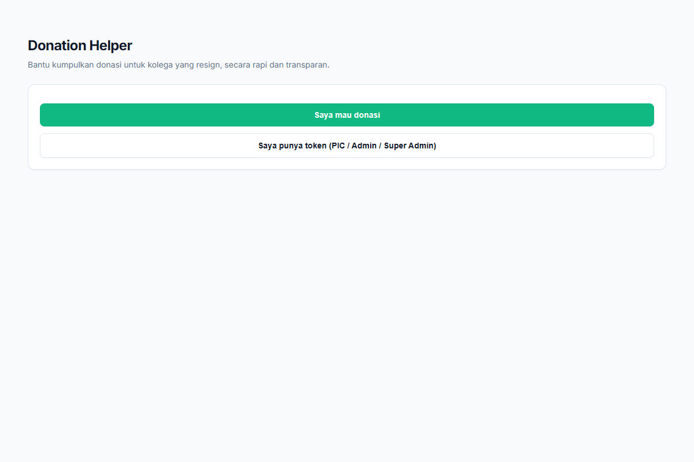
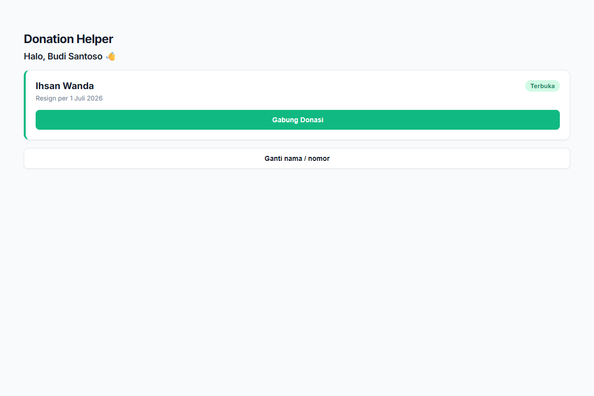
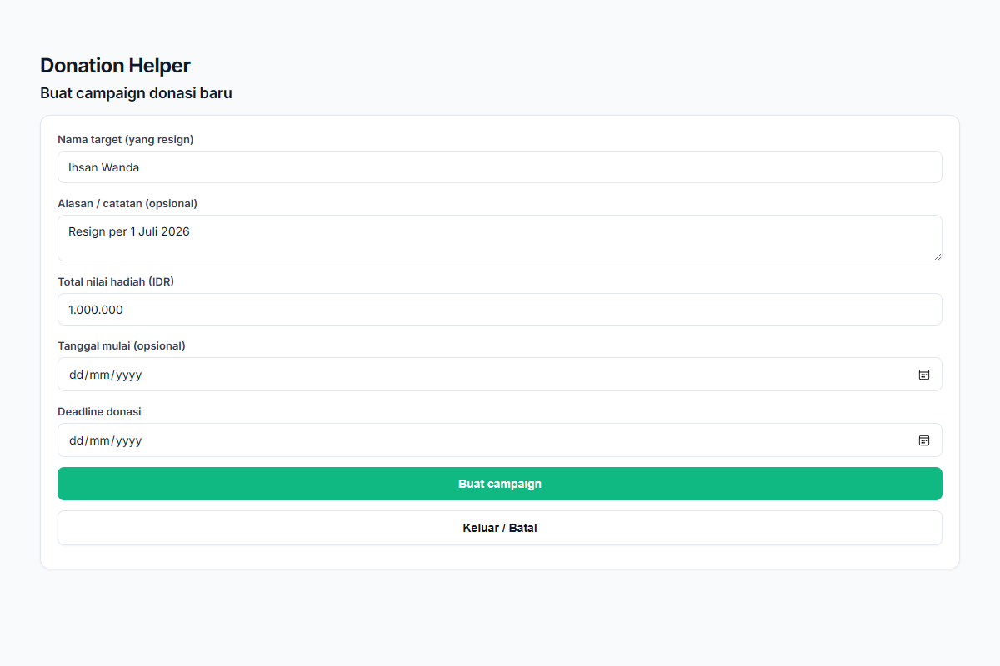

# Panduan Lengkap Penggunaan Aplikasi Donatur Helper untuk Rekan-rekan User & PIC

Halo Rekan-rekan PIC! Panduan ini dirancang untuk membantu Anda menggunakan aplikasi Donatur Helper dengan lancar, baik saat ingin ikut berdonasi maupun ketika bertugas sebagai PIC untuk sebuah kegiatan donasi.

Mari kita pelajari cara bernavigasi dan menggunakan fitur-fitur yang ada di dalamnya.

---

## 1. Memulai Aplikasi: Cara Masuk (Login)

Saat pertama kali membuka aplikasi, Anda akan melihat halaman utama dengan dua pilihan utama:

1. **"Saya mau donasi"**: Pilih opsi ini jika ingin melihat daftar donasi yang sedang berjalan dan ingin ikut berpartisipasi. Cukup masukkan nomor WhatsApp yang terdaftar.
2. **"Saya punya token"**: Pilih opsi ini jika menerima Token dari Admin untuk bertugas sebagai PIC. Masukkan token (contoh: `PIC-AB12CD34`) untuk masuk ke Dashboard PIC.

### Mendaftar Sebagai Pengguna Baru
Jika nomor WhatsApp belum terdaftar, Anda akan diminta mengisi formulir pendaftaran singkat (Nama Lengkap dan Status Karyawan). Pendaftaran akan diproses oleh tim Admin. Mohon tunggu persetujuan Admin agar dapat masuk dan melihat daftar campaign.

---

## 2. Navigasi Dashboard dan Berpindah Peran

Aplikasi ini sudah dirancang agar Anda bisa berpindah tampilan dengan mudah tanpa perlu keluar masuk aplikasi berulang kali. 

* **Dari Dashboard PIC ke Dashboard Member**: Jika sedang bertugas sebagai PIC namun juga ingin berdonasi secara personal, gunakan tombol **"Kembali ke Dashboard Member"**. 
* Tombol navigasi ini akan mengembalikan Anda ke tampilan donatur biasa sehingga bisa mengisi nominal donasi sendiri.

---

## 3. Panduan Khusus: Sebagai Donatur

Jika masuk sebagai donatur biasa, berikut adalah hal-hal yang dapat dilakukan di dalam **Dashboard Member**:

### Mengikuti Campaign Donasi
1. Di Dashboard, akan tampil daftar kegiatan donasi (campaign) yang berstatus **Terbuka** (Open).
2. Klik tombol **"Ikut Patungan"** pada kegiatan yang ingin didukung.
3. Anda dapat memilih untuk menggunakan nominal standar (dibagi rata nantinya) atau mengisi **Nominal Bebas** jika ingin memberikan jumlah tertentu.
4. Setelah donasi difinalisasi oleh PIC, Anda akan melihat rincian tagihan beserta informasi rekening tujuan. 

### Konfirmasi Transfer
Setelah melakukan transfer:
1. Kembali ke Dashboard Member dan temukan kegiatan yang tagihannya sudah muncul.
2. Klik tombol **"Konfirmasi Transfer"**.
3. Unggah bukti transfer. Status Anda akan berubah menjadi sudah membayar.

---

## 4. Panduan Khusus: Sebagai PIC

Sebagai PIC, Anda memiliki tanggung jawab untuk mengelola satu kegiatan donasi dari awal hingga selesai. 

### Membuat Campaign Baru
Setelah masuk menggunakan Token PIC yang belum terpakai, Anda akan diarahkan ke form pembuatan campaign:
1. Isi **Nama Target** (misal: kolega yang resign).
2. Isi **Total Nilai Hadiah** yang ingin dicapai. Nominal ini akan menjadi dasar pembagian tagihan.
3. Tentukan **Deadline Donasi**.
4. Klik **"Buat campaign"**.

### Mengelola Donatur & Finalisasi
Di **Dashboard PIC**, Anda dapat melihat daftar donatur yang sudah bergabung.
1. **Menutup Pendaftaran**: Klik tombol **"Tutup Pendaftaran (Hitung Tagihan)"** ketika waktu sudah habis atau jumlah donatur sudah cukup.
2. **Finalisasi Tagihan**: Pada tahap ini, sistem akan membagi total nilai hadiah dengan jumlah partisipan secara otomatis. Anda wajib mengisi data rekening bank penerima dana sebelum finalisasi.
3. **Mengingatkan Donatur**: Setelah tahap finalisasi, gunakan tombol **"Buat Pesan Reminder"** untuk menyalin template pesan WhatsApp. Kirimkan ke grup atau langsung japri ke donatur yang belum membayar menggunakan tombol logo WhatsApp yang tersedia di tabel.

### Mengunggah Bukti Pembelian & Mengarsipkan
Setelah semua dana terkumpul dan hadiah sudah dibeli:
1. Unggah bukti pembelian/struk di bagian **"Upload Bukti Pembelian"**. 
2. Jika seluruh proses sudah tuntas, klik tombol **"Archive Campaign"** agar kegiatan ini dipindahkan ke riwayat selesai dan tidak lagi tampil di daftar aktif donatur.

Jika mengalami kendala saat menggunakan form atau ada tombol yang tidak merespons, jangan khawatir. Cukup segarkan (refresh) halaman aplikasi di browser Anda dan coba kembali.
