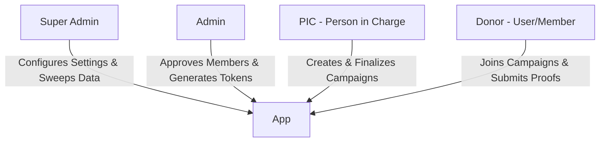
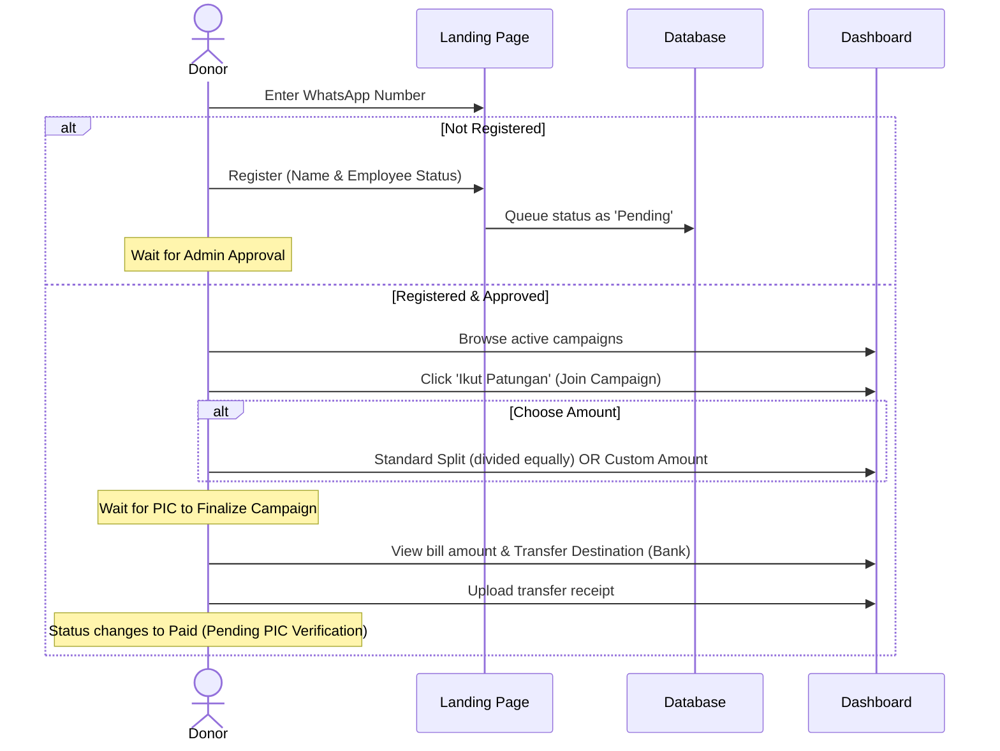
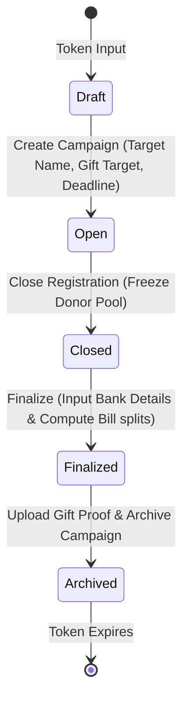

# Donatur Helper - Product Requirements Document (PRD)

This document provides a comprehensive overview of the **Donatur Helper** system, explaining its architecture, data models, role hierarchies, and flow of functions from the perspective of each user role.

---

## 1. System Overview

**Donatur Helper** is a lightweight, sheet-backed web application designed to facilitate group gifting or collective donations (e.g., buying farewell gifts for colleagues, charity events). 

### Tech Stack
* **Frontend**: Single-page application built in vanilla HTML, CSS, and JavaScript ([Index.html](file:///c:/Users/oneda/Projects/Donatur%20Helper/Index.html)).
* **Backend**: Google Apps Script ([Code.js](file:///c:/Users/oneda/Projects/Donatur%20Helper/Code.js)), bound to a Google Spreadsheet.
* **Database**: Google Sheets (used as relational tables: `Settings`, `Members`, `Tokens`, `Campaigns`, `Donors`, and `LateRequests`).
* **Deployment/Tooling**: Deployable directly via Apps Script Web App or fronted by platforms like Netlify.

---

## 2. Roles & Permissions Hierarchy

The system defines four roles, each with strict boundaries:

| Role | Auth Mechanism | Primary Scope |
|---|---|---|
| **Donor (User/Member)** | Registered WhatsApp Number | View open campaigns, join/leave, upload payment receipts. |
| **PIC (Person In Charge)** | Unique single-use token (`PIC-XXXX`) | Create campaign, finalize bills, collect proofs, archive. |
| **Admin** | Unique persistent token (`Admin` status in sheet) | Approve new user registrations, generate PIC tokens. |
| **Super Admin** | Secure script-property token (`SA-XXXX`)| Modify global settings, sweep historical data to cold storage. |

---

## 3. POV Functional Flows

### B. Donor (User/Member) POV
A donor is any verified employee/member who wants to contribute to active gifting campaigns.

#### Detailed Features:
1. **Self-Registration Gate**: Unregistered users enter their Name and Employee Status. The request enters a `Pending` state.
2. **Dashboard Browsing**: View all active campaigns with details (Target name, reason, deadline, participant counts, and status: *Open, Closed, or Finalized*).
3. **Pledge Options**:
   * **Standard Pledge**: Join the pool. The actual payment amount is determined after the campaign is finalized by the PIC.
   * **Custom Pledge**: Pledge a fixed, custom amount. The remaining target amount is split among standard pledge participants.
4. **Opt-Out (Withdraw)**: Donors can withdraw from a campaign as long as the campaign status is still `Open`.
5. **Bill & Transfer Receipt Submission**: Once the campaign is `Finalized`, donors see the bank account details, copy the exact billing amount, make the transfer, and upload their payment proof.

---

### C. PIC (Person In Charge) POV
The PIC is the organizer of a specific campaign. Their role is to manage the timeline, compute bills, nudge participants, and confirm payments.

#### Detailed Features:
1. **Campaign Creation**: Log in using a `PIC-XXXX` token generated by the Admin. Input the Target Name, Reason, Target Gift Value, and Deadline to open a new campaign.
2. **Donor Pool Management**: View real-time lists of joined donors (showing Standard vs. Custom pledges).
3. **Pendaftaran Control**: Close registration to freeze the pool, or reopen if someone missed the window.
4. **Gifting Finalization**:
   * Enter bank account details (Bank Name, Account Number, Account Holder Name).
   * Confirm the final target amount. The system automatically computes the split bills (taking custom pledges and rounding rules into account).
   * Upload target gift link/mockup.
5. **Collection & Reminders**:
   * Access built-in templates to copy a global group reminder message.
   * Use direct `wa.me` links to send personalized reminders to unpaid donors in one click.
6. **Payment Verification**: Review payment proofs uploaded by donors and click **Verify** to confirm or **Reject** if the proof is invalid.
7. **Refund Management**: Mark donors as refunded if they overpaid or require correction.
8. **Archiving**: Once all payments are verified and the gift is bought, upload the gift receipt/picture and click **Archive**. The campaign is locked, and the PIC token is expired.

---

### D. Admin POV
Admins handle user vetting and authorize PICs to prevent spam and ensure the dashboard remains secure.

#### Detailed Features:
1. **PIC Token Generation**: Generate new single-use `PIC-XXXX` tokens to hand out to employees who want to start campaigns.
2. **User Vetting & Approvals**: View the queue of self-registered WhatsApp users. Approve them to grant access, or update member lists (Name, Status).
3. **Akses Revocation**: Revoke active or unused PIC tokens if campaigns are canceled.
4. **System Metrics**: Monitor aggregate statistics (total collected funds, count of open campaigns, active user database size).

---

### E. Super Admin POV
Super Admins oversee the infrastructure and control global business rules.

#### Detailed Features:
1. **Config Management**: Toggle global settings:
   * `RequireMemberValidation`: Toggles the approval gate for new registrants.
   * `EnableRounding` / `RoundToNearest`: Configures billing math (e.g. rounding standard splits up to the nearest Rp500 or Rp1,000).
2. **Cold-Storage Sweeping**: Trigger `sweepArchivedData` to archive historical data from the active `Campaigns` and `Donors` sheets into `Campaigns_Archive` and `Donors_Archive` sheets, keeping the active sheets fast and clean.

---

## 4. Key Computational Logic

The backend splits the final gift value among donors using the following rule:
$$\text{Standard Split Bill} = \frac{\text{Final Gift Target} - \text{Sum of Custom Pledges}}{\text{Total Standard Donors}}$$

* **If Rounding is Disabled**: The standard split bill is calculated using integer division. Any remainder is distributed Rp1 at a time to the first few donors in the pool, ensuring the sum of all payments equals the final target *exactly*.
* **If Rounding is Enabled (e.g., Round to Nearest 500)**: The split bill is rounded up to the nearest interval:
$$\text{Rounded Bill} = \left\lceil \frac{\text{Standard Split Bill}}{\text{Rounding Interval}} \right\rceil \times \text{Rounding Interval}$$
Any small overage collected remains in the bank account buffer to cover transfer fees or minor adjustments.
