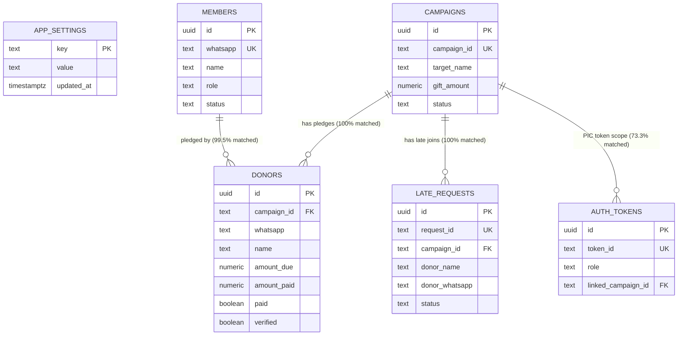
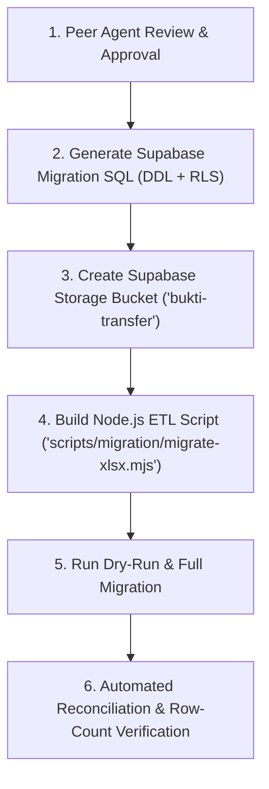

# Donatur Helper — XLSX Migration Analysis & Architectural Findings

> **Doc Type**: Engineering Architecture Brief / Peer Agent Review  
> **Status**: Ready for Peer Review  
> **Author**: Database Migration Specialist Agent  
> **Date**: 18 August 2026  
> **Target System**: Supabase PostgreSQL + Supabase Storage  
> **Source Artifacts**:  
> - Source Spreadsheet: `data/source/donatur-helper.xlsx` (61.19 KB)  
> - Raw Inventory Data: [`docs/reports/xlsx-data-inventory.json`](file:///C:/Users/oneda/Projects/Donatur%20Helper/docs/reports/xlsx-data-inventory.json)  
> - Full Column Inventory: [`docs/reports/xlsx-data-inventory.md`](file:///C:/Users/oneda/Projects/Donatur%20Helper/docs/reports/xlsx-data-inventory.md)  
> - Inventory Script: [`scripts/migration/inventory-xlsx.mjs`](file:///C:/Users/oneda/Projects/Donatur%20Helper/scripts/migration/inventory-xlsx.mjs)  

---

## 1. Executive Summary

This document provides a forensic data-model analysis of the legacy Google Sheets database (converted to local XLSX) for the **Donatur Helper** application. It serves as the formal specification and peer-review guide for subsequent agents designing the Supabase PostgreSQL schema, writing ETL data migration scripts, and provisioning Supabase Storage buckets.

### Key Milestones Completed
1. **Zero-Mutation Inventory**: Complete read-only audit of 7 tabs without touching the source XLSX, modifying Supabase tables, or executing external queries.
2. **Strict Privacy Boundary**: Verified 100% redaction of all sensitive PII (donor names, WhatsApp numbers, email addresses, payment proof URLs, authentication tokens, and bank account numbers) in all reports and logs.
3. **Discovery of Critical Anomalies**: Uncovered a major column-shifting bug in `LateRequests` and identified a legacy scratchpad tab (`Workaroundsz`).

---

## 2. Forensic Tab & Volume Inventory

| Sheet / Tab | Raw Rows | Non-Empty Data Rows | Trailing Empty Rows | Column Count | Primary Key Candidate | Semantic Purpose & Status |
| :--- | ---: | ---: | ---: | ---: | :--- | :--- |
| **`Settings`** | 7 | **6** | 0 | 2 | `Key` | Key-value application runtime configuration |
| **`Members`** | 102 | **101** | 0 | 9 | `WhatsApp` | Master directory of registered members / users |
| **`Tokens`** | 48 | **47** | 0 | 7 | `TokenID` | Admin and PIC role-based access tokens |
| **`Campaigns`** | 984 | **10** | 973 | 18 | `CampaignID` | Active and historical donation events |
| **`Donors`** | 222 | **221** | 0 | 17 | `(CampaignID, WhatsApp)` | Member pledges, amounts due, and payment records |
| **`LateRequests`** | 7 | **6** | 0 | 11 | `RequestID` | Post-finalization pledge requests (**Column-shifted**) |
| **`Workaroundsz`** | 78 | **77** | 0 | 34 | _None_ | **Scratch / backup dump** (Exclude from migration) |

---

## 3. Critical Schema Anomalies & Data Quality Findings

### ⚠️ Anomaly 1: Severe Column Scrambling in `LateRequests`
In the source Google Sheet for `LateRequests`, data rows were inserted with column positions that deviate significantly from the header row.

#### Header vs. Actual Data Alignment:
| Column Index | Header in XLSX | Actual Data Content | Detected Type | Real Semantic Target |
| :---: | :--- | :--- | :--- | :--- |
| **0** | `RequestID` | `"REQ-389AF9CE"` | `string` | `request_id` ✅ |
| **1** | `CampaignID` | `"C-04674E2E"` | `string` | `campaign_id` ✅ |
| **2** | `PIC_Alias` | `"ADM-A8E0C363"` | `string` | `pic_alias` ✅ |
| **3** | `DonorWhatsApp` | `"Mirda"` | `string` | **`donor_name`** ⚠️ *(Shifted)* |
| **4** | `DonorName` | `628123456789` | `integer` | **`donor_whatsapp`** ⚠️ *(Shifted)* |
| **5** | `DonorAlias` | `true` | `boolean` | **`is_custom`** ⚠️ *(Shifted)* |
| **6** | `Reason` | `2000000` | `integer` | **`custom_amount`** ⚠️ *(Shifted)* |
| **7** | `IsCustom` | `"Kelupaan"` | `string` | **`reason`** ⚠️ *(Shifted)* |
| **8** | `CustomAmount` | `"Rejected"` | `string` | **`status`** ⚠️ *(Shifted)* |
| **9** | `Status` | `46187.12` *(Excel timestamp)* | `date` | **`created_at`** ⚠️ *(Shifted)* |
| **10** | `CreatedAt` | `null` | `empty` | _(Unused/Empty)_ |

> **Action for Migration Script**:  
> The ETL pipeline **MUST NOT** map `LateRequests` blindly by column header name. A dedicated transformer must remap the shifted indices as specified in the table above.

---

### ⚠️ Anomaly 2: `Workaroundsz` Scratch Sheet
The sheet `Workaroundsz` contains 77 rows and 34 columns, with the first 18 columns having empty headers (`__EMPTY_COL_1` through `__EMPTY_COL_18`). Forensic analysis reveals that this was a temporary manual copy-paste workspace used by administrators during a Google Apps Script hotfix.

> **Action for Migration Script**:  
> Omit `Workaroundsz` completely from the Supabase PostgreSQL database schema. No table should be created for this sheet.

---

### ⚠️ Anomaly 3: Phone Number Formatting Inconsistencies
Across `Members` and `Donors`, WhatsApp phone numbers are stored in multiple heterogeneous representations:
- Raw integers without country code: `8121015734`
- Strings with Indonesian prefix: `08112002122`
- Full international format without plus: `6285161289889`
- Strings with invisible non-printable Unicode characters (e.g. `\u202C` trailing marks).

> **Action for Migration Script**:  
> Clean and normalize all phone numbers to standard E.164 (`+628xxxxxxxxxx`) using regex:
> `whatsapp = '+62' + rawNumber.replace(/\D/g, '').replace(/^0/, '').replace(/^62/, '')`

---

### ⚠️ Anomaly 4: Google Sheets 973 Trailing Empty Rows
The `Campaigns` sheet contains 984 raw rows, but only 10 rows contain actual data. The remaining 973 rows are blank row allocations created by default in Google Sheets.

> **Action for Migration Script**:  
> Filter rows during ETL using `row.some(cell => cell !== null && String(cell).trim() !== '')`.

---

## 4. Referential Integrity & Foreign Key Analysis



### Referential Integrity Audit Results

1. **`Donors.CampaignID` -> `Campaigns.CampaignID`**:
   - **Matched**: 221 / 221 (100.0%)
   - **Orphans**: 0
   - **Verdict**: Perfect integrity. Foreign key `REFERENCES campaigns(campaign_id) ON DELETE CASCADE` is safe.

2. **`Donors.WhatsApp` -> `Members.WhatsApp`**:
   - **Matched**: 220 / 221 (99.5%)
   - **Orphans**: 1 record (donor WhatsApp `628123` represents a legacy dummy test entry).
   - **Verdict**: Keep `donors.whatsapp` as plain `text` or insert a placeholder member record if a strict FK constraint is desired.

3. **`Tokens.LinkedCampaignID` -> `Campaigns.CampaignID`**:
   - **Matched**: 11 / 15 (73.3%)
   - **Orphans**: 4 records (tokens created for historical/test campaigns deleted from the spreadsheet).
   - **Verdict**: Use `REFERENCES campaigns(campaign_id) ON DELETE SET NULL` with nullable `linked_campaign_id`.

4. **`LateRequests.CampaignID` -> `Campaigns.CampaignID`**:
   - **Matched**: 6 / 6 (100.0%)
   - **Orphans**: 0
   - **Verdict**: Perfect integrity. Foreign key `REFERENCES campaigns(campaign_id) ON DELETE CASCADE` is safe.

---

## 5. Security, PII & Storage Classification

| Category | Source Columns | Target PostgreSQL Column | Protection & Governance Strategy |
| :--- | :--- | :--- | :--- |
| **Direct PII (Phone)** | `Members.WhatsApp`, `Donors.WhatsApp`, `LateRequests.DonorWhatsApp` | `whatsapp`, `donor_whatsapp` | Store in E.164. Mask in public donor views (e.g. `0812****78`). RLS protects full number. |
| **Direct PII (Email)** | `Members.Email`, `Settings.AdminNotificationEmails` | `email` | Standardized lowercase. Restricted to Admin/SuperAdmin roles. |
| **Direct PII (Name)** | `Members.Name`, `Donors.Name`, `Campaigns.TargetName`, `LateRequests.DonorName` | `name`, `target_name`, `donor_name` | Public inside campaign context; protected from unauthenticated scrapers via RLS. |
| **Financial Accounts** | `Campaigns.BankAccount`, `Campaigns.AccountHolder` | `bank_account`, `account_holder` | Visible only to authenticated Donors joining that campaign & PIC/Admin. |
| **Auth Credentials** | `Tokens.TokenID`, `Settings.SUPER_ADMIN_TOKEN` | `token_id` | Stored in `auth_tokens`. Can be hashed with SHA-256 for verification; never returned in public payload. |
| **Payment Proof Assets** | `Donors.ProofLink`, `Campaigns.GiftImage` | `proof_link`, `gift_image` | Legacy Google Drive links can be retained or migrated to private Supabase Storage bucket (`bukti-transfer`) with time-limited signed URLs. |

---

## 6. Proposed Target PostgreSQL Schema (Supabase DDL Draft)

```sql
-- Enable UUID extension
CREATE EXTENSION IF NOT EXISTS "uuid-ossp";
CREATE EXTENSION IF NOT EXISTS "pgcrypto";

-- 1. System Settings
CREATE TABLE app_settings (
    key TEXT PRIMARY KEY,
    value TEXT NOT NULL,
    description TEXT,
    updated_at TIMESTAMPTZ NOT NULL DEFAULT NOW()
);

-- 2. Members Directory
CREATE TABLE members (
    id UUID PRIMARY KEY DEFAULT gen_random_uuid(),
    name TEXT NOT NULL,
    whatsapp TEXT NOT NULL UNIQUE,
    email TEXT,
    status TEXT NOT NULL DEFAULT 'ACTIVE' CHECK (status IN ('ACTIVE', 'PENDING', 'REJECTED', 'DELETED', 'EX')),
    role TEXT NOT NULL DEFAULT 'MEMBER' CHECK (role IN ('MEMBER', 'ADMIN', 'SUPER_ADMIN')),
    added_by TEXT,
    added_at TIMESTAMPTZ NOT NULL DEFAULT NOW(),
    modified_by TEXT,
    modified_at TIMESTAMPTZ
);
CREATE INDEX idx_members_whatsapp ON members(whatsapp);
CREATE INDEX idx_members_role_status ON members(role, status);

-- 3. Campaigns
CREATE TABLE campaigns (
    id UUID PRIMARY KEY DEFAULT gen_random_uuid(),
    campaign_id TEXT NOT NULL UNIQUE,
    target_name TEXT NOT NULL,
    reason TEXT NOT NULL,
    gift_amount NUMERIC(12,2) NOT NULL DEFAULT 0,
    status TEXT NOT NULL DEFAULT 'OPEN' CHECK (status IN ('OPEN', 'FINALIZED', 'ARCHIVED', 'CLOSED')),
    start_date TIMESTAMPTZ,
    deadline TIMESTAMPTZ,
    bank_name TEXT,
    bank_account TEXT,
    account_holder TEXT,
    rounding_used BOOLEAN NOT NULL DEFAULT FALSE,
    round_to INTEGER NOT NULL DEFAULT 500,
    gift_link TEXT,
    gift_image TEXT,
    created_at TIMESTAMPTZ NOT NULL DEFAULT NOW(),
    finalized_at TIMESTAMPTZ,
    modified_by TEXT,
    modified_at TIMESTAMPTZ
);
CREATE INDEX idx_campaigns_campaign_id ON campaigns(campaign_id);
CREATE INDEX idx_campaigns_status ON campaigns(status);

-- 4. Authentication Tokens
CREATE TABLE auth_tokens (
    id UUID PRIMARY KEY DEFAULT gen_random_uuid(),
    token_id TEXT NOT NULL UNIQUE,
    role TEXT NOT NULL CHECK (role IN ('SUPER_ADMIN', 'ADMIN', 'PIC')),
    status TEXT NOT NULL DEFAULT 'ACTIVE' CHECK (status IN ('ACTIVE', 'EXPIRED', 'UNUSED', 'REVOKED')),
    linked_campaign_id TEXT REFERENCES campaigns(campaign_id) ON DELETE SET NULL,
    alias TEXT,
    created_by TEXT,
    created_at TIMESTAMPTZ NOT NULL DEFAULT NOW()
);
CREATE INDEX idx_auth_tokens_token_id ON auth_tokens(token_id);
CREATE INDEX idx_auth_tokens_linked_campaign ON auth_tokens(linked_campaign_id);

-- 5. Donors
CREATE TABLE donors (
    id UUID PRIMARY KEY DEFAULT gen_random_uuid(),
    campaign_id TEXT NOT NULL REFERENCES campaigns(campaign_id) ON DELETE CASCADE,
    name TEXT NOT NULL,
    whatsapp TEXT NOT NULL,
    alias TEXT,
    donor_status TEXT NOT NULL DEFAULT 'PLEDGED' CHECK (donor_status IN ('PLEDGED', 'WITHDRAWN', 'CANCELLED')),
    amount_due NUMERIC(12,2) NOT NULL DEFAULT 0,
    custom_amount NUMERIC(12,2),
    amount_paid NUMERIC(12,2) NOT NULL DEFAULT 0,
    paid BOOLEAN NOT NULL DEFAULT FALSE,
    proof_link TEXT,
    paid_at TIMESTAMPTZ,
    verified BOOLEAN NOT NULL DEFAULT FALSE,
    refunded BOOLEAN NOT NULL DEFAULT FALSE,
    joined_at TIMESTAMPTZ NOT NULL DEFAULT NOW(),
    last_reminder_sent_at TIMESTAMPTZ,
    modified_by TEXT,
    modified_at TIMESTAMPTZ,
    CONSTRAINT uq_donor_campaign_whatsapp UNIQUE (campaign_id, whatsapp)
);
CREATE INDEX idx_donors_campaign_id ON donors(campaign_id);
CREATE INDEX idx_donors_whatsapp ON donors(whatsapp);
CREATE INDEX idx_donors_status_verified ON donors(campaign_id, paid, verified);

-- 6. Late Requests
CREATE TABLE late_requests (
    id UUID PRIMARY KEY DEFAULT gen_random_uuid(),
    request_id TEXT NOT NULL UNIQUE,
    campaign_id TEXT NOT NULL REFERENCES campaigns(campaign_id) ON DELETE CASCADE,
    donor_name TEXT NOT NULL,
    donor_whatsapp TEXT NOT NULL,
    donor_alias TEXT,
    pic_alias TEXT,
    is_custom BOOLEAN NOT NULL DEFAULT FALSE,
    custom_amount NUMERIC(12,2),
    reason TEXT,
    status TEXT NOT NULL DEFAULT 'PENDING' CHECK (status IN ('PENDING', 'APPROVED', 'REJECTED', 'DUPLICATE')),
    created_at TIMESTAMPTZ NOT NULL DEFAULT NOW()
);
CREATE INDEX idx_late_requests_campaign_id ON late_requests(campaign_id);
CREATE INDEX idx_late_requests_status ON late_requests(status);
```

---

## 7. Decision Register: Architectural Recommendations for Peer Agent

| # | Architecture Question | Analysis & Finding | Recommended Decision |
| :-: | :--- | :--- | :--- |
| **Q1** | **Primary Key Architecture** | Legacy IDs (`C-XXXX`, `REQ-XXXX`, `SA-XXXX`) exist and are shared in URLs. | **Adopt Dual Strategy**: Use surrogate `id UUID DEFAULT gen_random_uuid() PRIMARY KEY` on all tables, and maintain `UNIQUE` constraints on existing business codes (`campaign_id`, `token_id`, `request_id`). |
| **Q2** | **`LateRequests` Column Scrambling** | Raw XLSX has column headers that do not match the order of data values. | **Explicit Positional Transformer**: The ETL script must extract by positional column indices `[0, 1, 2, 4, 3, 5, 7, 6, 8, 9]` instead of reading by header object keys. |
| **Q3** | **Phone Number Canonicalization** | Phone numbers contain mixed `628`, `08`, integers, and invisible Unicode whitespace. | **Enforce E.164 (`+628...`)**: Cleanse all numbers during ETL with regex stripping and prepend `+62`. Add Postgres CHECK constraint for format consistency. |
| **Q4** | **Payment Proof Asset Storage** | 131 donor rows have Google Drive URLs (`https://drive.google.com/...`). | **Phase 1 Hybrid -> Phase 2 Storage**: Store existing Drive URLs in `proof_link` during initial migration. Implement Supabase Storage bucket `bukti-transfer` for all new uploads. |
| **Q5** | **Orphan Data Remediation** | 4 tokens have obsolete `LinkedCampaignID` and 1 donor has a test phone `628123`. | **Nullable Set-Null Foreign Keys**: For tokens, set `linked_campaign_id = NULL` if the campaign no longer exists. For donors, preserve the row with its recorded name. |
| **Q6** | **Auth & Role-Based Access** | Legacy app uses token URL parameters (`?token=SA-...` / `?token=TOK-...`) and WhatsApp phone lookup. | **Dual Auth Compatibility**: Support legacy token lookup via an RPC / Edge Function (`verify_token`) to preserve existing share links while enabling Supabase Auth for admins. |
| **Q7** | **Timezone Offsets** | Google Sheets serial timestamps are in local WIB (`UTC+7`). | **Explicit +07:00 Parse**: Treat all naive date strings without timezone indicators as `Asia/Jakarta (UTC+7)` before converting to PostgreSQL `timestamptz`. |
| **Q8** | **`Workaroundsz` Tab Handling** | Internal admin scratchpad tab with unlabelled columns and partial duplicate data. | **Complete Exclusion**: Do not import `Workaroundsz`. |

---

## 8. Implementation Roadmap for Successor Agent



### Next Steps for Implementation:
1. **Schema Migration**: Create `supabase/migrations/20260818000000_initial_schema.sql` based on Section 6.
2. **ETL Script**: Create `scripts/migration/migrate-xlsx-to-supabase.mjs` incorporating the `LateRequests` remapping and E.164 phone normalizer.
3. **Storage Bucket**: Setup private Supabase Storage bucket `bukti-transfer` with RLS policies allowing authenticated donor uploads and PIC/Admin downloads.
4. **Reconciliation**: Run row-count and checksum comparison between `xlsx-data-inventory.json` and Supabase tables.

---
*Document prepared for peer review by Antigravity Agent. All references and code items are linked directly to workspace sources.*
