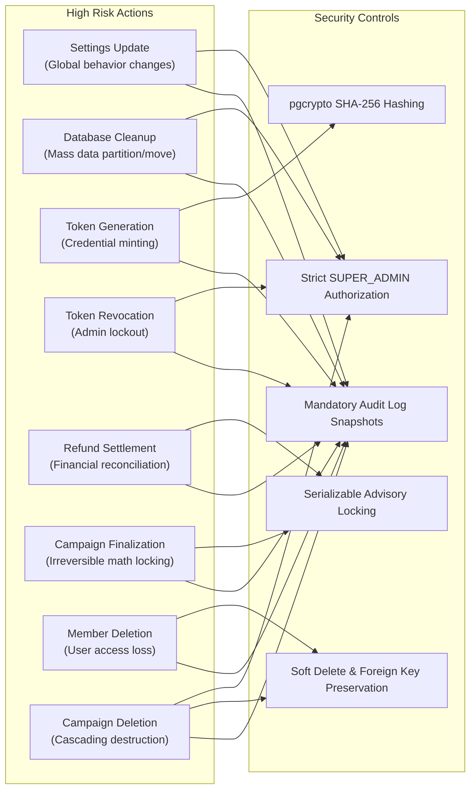

# Legacy Backend Action & Mutation Inventory Report

**Project**: Donatur Helper  
**Date**: 2026-08-19  
**Status**: Completed  
**Format**: Markdown & JSON Reference  
**Machine-Readable Twin**: [`docs/reports/legacy-action-inventory.json`](file:///C:/Users/oneda/Projects/Donatur%20Helper/docs/reports/legacy-action-inventory.json)

---

## 1. Executive Summary

This inventory documents all backend interactions, client-side invocation points (`fetchBackend`, `call`, `callQueued`), Google Apps Script (`Code.js`) actions, and event-driven data mutations across the Donatur Helper application.

The codebase audit reveals:
- **12 Legacy Read Operations**: Completely mapped and replaceable by 7 existing, high-performance Supabase aggregated PostgreSQL RPC functions (`verify_auth_token`, `get_admin_dashboard_stage1`, `get_admin_campaigns`, `get_admin_members`, `get_pic_dashboard`, `get_superadmin_dashboard_stage1`, `get_donor_dashboard`).
- **21 User-Triggered Mutation Operations**: Requiring migration to atomic Supabase PostgreSQL RPCs, grouped across Donor, PIC, Admin, and SuperAdmin roles.
- **8 Critical/Dangerous Operations**: Requiring heightened security, strict role validation, advisory locking, and transaction atomicity to prevent race conditions or data loss.
- **Top 5 Priority RPCs**: Identified to unblock core user workflows (pledging, proof upload, campaign creation, finalization, and payment verification).

```mermaid
graph TD
    subgraph Frontend Surface
        UI_Landing[Landing Page]
        UI_Donor[Donor Dashboard]
        UI_PIC[PIC Workspace]
        UI_Admin[Admin Dashboard]
        UI_SA[SuperAdmin Console]
    end

    subgraph Existing Read RPCs
        RPC_Auth[verify_auth_token]
        RPC_Donor[get_donor_dashboard]
        RPC_PIC[get_pic_dashboard]
        RPC_Admin1[get_admin_dashboard_stage1]
        RPC_Admin2[get_admin_campaigns / get_admin_members]
        RPC_SA1[get_superadmin_dashboard_stage1]
    end

    subgraph Proposed Mutation RPCs
        M_Donor["Donor Mutations<br/>(join, submit_proof, withdraw, register)"]
        M_PIC["PIC Mutations<br/>(create, finalize, verify_payment, refund)"]
        M_Admin["Admin Mutations<br/>(approve_member, approve_late, recalculate)"]
        M_SA["SuperAdmin Mutations<br/>(tokens, roles, settings, purge)"]
    end

    UI_Landing --> RPC_Auth
    UI_Donor --> RPC_Donor
    UI_Donor --> M_Donor
    UI_PIC --> RPC_PIC
    UI_PIC --> M_PIC
    UI_Admin --> RPC_Admin1
    UI_Admin --> RPC_Admin2
    UI_Admin --> M_Admin
    UI_SA --> RPC_SA1
    UI_SA --> M_SA
```



---

## 2. Read Actions Replaceable by Existing Supabase RPCs

The table below catalogs every legacy read operation invoked by the frontend and links it to the corresponding PostgreSQL RPC function already implemented in `supabase/migrations/`:

| Legacy Action | Frontend Caller (`js/`) | Recommended Supabase RPC | Migration SQL File | Target Domain & Description |
| :--- | :--- | :--- | :--- | :--- |
| `loginWithToken` | `auth.js:208` (`tokenLogin`) | [`verify_auth_token(p_token)`](file:///C:/Users/oneda/Projects/Donatur%20Helper/supabase/migrations/20260818010000_verify_auth_token.sql) | `20260818010000_verify_auth_token.sql` | Authenticates plaintext tokens against SHA-256 hashes in `auth_tokens`, returns role, alias, and linked campaign. |
| `getDashboardSummary` | `admin.js:38` (`refreshSummary`) | [`get_admin_dashboard_stage1(p_token)`](file:///C:/Users/oneda/Projects/Donatur%20Helper/supabase/migrations/20260818020000_get_admin_dashboard_stage1.sql) | `20260818020000_get_admin_dashboard_stage1.sql` | Aggregates summary counts (members, campaigns, donors, pending registrations, unverified proofs). |
| `getPendingMembers` | `admin.js:133`, `auth.js:313` | [`get_admin_dashboard_stage1(p_token)`](file:///C:/Users/oneda/Projects/Donatur%20Helper/supabase/migrations/20260818020000_get_admin_dashboard_stage1.sql) | `20260818020000_get_admin_dashboard_stage1.sql` | Returns unapproved member registrations in Stage 1 payload. |
| `getPendingLateRequests` | `admin.js:273` (`refreshLateRequests`) | [`get_admin_dashboard_stage1(p_token)`](file:///C:/Users/oneda/Projects/Donatur%20Helper/supabase/migrations/20260818020000_get_admin_dashboard_stage1.sql) | `20260818020000_get_admin_dashboard_stage1.sql` | Returns pending late requests awaiting admin decision in Stage 1 payload. |
| `listAllCampaigns` | `admin.js:480`, `admin.js:1135` | [`get_admin_campaigns(p_token, page, size, status)`](file:///C:/Users/oneda/Projects/Donatur%20Helper/supabase/migrations/20260818030000_get_admin_stage2.sql) | `20260818030000_get_admin_stage2.sql` | Paginated campaign directory with donor counts, collected amounts, deadlines, and PIC aliases. |
| `fetchAllMembers` | `admin.js:593`, `admin.js:951` | [`get_admin_members(p_token, page, size, q, status, role)`](file:///C:/Users/oneda/Projects/Donatur%20Helper/supabase/migrations/20260818030000_get_admin_stage2.sql) | `20260818030000_get_admin_stage2.sql` | Paginated member directory with name/phone search and status/role filtering. |
| `getCampaignForPic` | `pic.js:10`, `pic.js:963` | [`get_pic_dashboard(p_token, page, size)`](file:///C:/Users/oneda/Projects/Donatur%20Helper/supabase/migrations/20260818040000_get_pic_dashboard.sql) | `20260818040000_get_pic_dashboard.sql` | Consolidates PIC token data, campaign info, progress metrics, and prioritized donor action queue. |
| `getSettingsForSuperAdmin` | `superadmin.js:11` | [`get_superadmin_dashboard_stage1(p_token)`](file:///C:/Users/oneda/Projects/Donatur%20Helper/supabase/migrations/20260818050000_get_superadmin_dashboard_stage1.sql) | `20260818050000_get_superadmin_dashboard_stage1.sql` | Returns domain metrics across all tables, pending queues, and system settings (with secret masking). |
| `checkDonorWhatsApp` | `auth.js:56` (`userLogin`) | [`get_donor_dashboard(p_whatsapp)`](file:///C:/Users/oneda/Projects/Donatur%20Helper/supabase/migrations/20260818060000_get_donor_dashboard.sql) | `20260818060000_get_donor_dashboard.sql` | Checks WhatsApp registration status and retrieves donor identity. |
| `listActiveCampaigns` | `donor.js:169` (`refreshCampaignList`) | [`get_donor_dashboard(p_whatsapp)`](file:///C:/Users/oneda/Projects/Donatur%20Helper/supabase/migrations/20260818060000_get_donor_dashboard.sql) | `20260818060000_get_donor_dashboard.sql` | Returns joined campaigns with billings and unjoined open campaigns for the authenticated donor. |
| `getUserPicCampaigns` | `donor.js:155` (`refreshCampaignList`) | [`get_donor_dashboard(p_whatsapp)`](file:///C:/Users/oneda/Projects/Donatur%20Helper/supabase/migrations/20260818060000_get_donor_dashboard.sql) | `20260818060000_get_donor_dashboard.sql` | Embedded in donor dashboard payload (PIC campaigns created by the caller). |
| `getPublicSettings` | `pic.js:591` (`showFinalizeForm`) | [`get_donor_dashboard(p_whatsapp)`](file:///C:/Users/oneda/Projects/Donatur%20Helper/supabase/migrations/20260818060000_get_donor_dashboard.sql) | `20260818060000_get_donor_dashboard.sql` | Embedded in dashboard RPC payloads (`rounding_used`, `round_to`). |

---

## 3. Mutation Actions Requiring Supabase RPC Implementation

The 21 mutation actions below alter database state and require implementation as secure, transactional PostgreSQL RPC functions (`SECURITY DEFINER`).

### 3.1 Donor Mutations

#### 1. `registerUser`
- **Legacy Action Name**: `registerUser`
- **Triggering UI Element**: `userLogin()` in [`js/views/auth.js`](file:///C:/Users/oneda/Projects/Donatur%20Helper/js/views/auth.js#L110) -> Form `#u-register-fields`, Button `#btn-u-login` ("Selesaikan Pendaftaran").
- **Required Input Fields**: `name` (TEXT), `whatsapp` (TEXT), `empStatus` (TEXT: `'active'` | `'ex'`).
- **Target Table**: `members`, `audit_logs`.
- **Expected Side Effects**: Normalizes phone to E.164 (`+62...`), inserts into `members` with `status = 'PENDING'`, `role = 'MEMBER'`, `added_by = 'Self-Registered - ' || empStatus`, `added_at = NOW()`.
- **Authorization Role**: Public / Unauthenticated Donor.
- **Validation Rules**:
  - `name` cannot be empty.
  - `whatsapp` must be a valid Indonesian mobile number.
  - `empStatus` must be either `'active'` or `'ex'`.
  - Phone must not already belong to an active member.
- **Idempotency Risk**: Medium — Rapid repeated clicks should not generate duplicate members.
- **Recommended Supabase RPC**: `register_donor_member(p_name TEXT, p_whatsapp TEXT, p_emp_status TEXT)`
- **Priority**: **Critical**

#### 2. `updateMemberProfile`
- **Legacy Action Name**: `updateMemberProfile`
- **Triggering UI Element**: `saveProfile()` in [`js/views/donor.js`](file:///C:/Users/oneda/Projects/Donatur%20Helper/js/views/donor.js#L45) -> Modal `#profile-modal`, Button "Simpan Profil".
- **Required Input Fields**: `whatsapp` (TEXT), `name` (TEXT).
- **Optional Input Fields**: `email` (TEXT).
- **Target Table**: `members`, `audit_logs`.
- **Expected Side Effects**: Updates `name` and `email` on `members` record matching phone; updates `modified_by` and `modified_at`.
- **Authorization Role**: Donor (Authenticated via verified WhatsApp session).
- **Validation Rules**:
  - `whatsapp` must belong to an existing active member.
  - `name` must not be blank.
  - `email` must match standard email pattern if provided.
- **Idempotency Risk**: Low.
- **Recommended Supabase RPC**: `update_member_profile(p_whatsapp TEXT, p_name TEXT, p_email TEXT)`
- **Priority**: **Important**

#### 3. `generateSeamlessPicToken`
- **Legacy Action Name**: `generateSeamlessPicToken`
- **Triggering UI Element**: `seamlessBecomePic()` in [`js/views/donor.js`](file:///C:/Users/oneda/Projects/Donatur%20Helper/js/views/donor.js#L110) -> Button `+ Buat Campaign Baru (Jadi PIC)`.
- **Required Input Fields**: `whatsapp` (TEXT).
- **Target Table**: `auth_tokens`, `audit_logs`.
- **Expected Side Effects**: Generates unique `PIC-XXXX` token, stores SHA-256 hash in `auth_tokens` (`role = 'PIC'`, `status = 'UNUSED'`, `created_by = whatsapp`), returns plaintext token to client.
- **Authorization Role**: Donor (Must be registered with `status = 'ACTIVE'`).
- **Validation Rules**:
  - Caller WhatsApp must exist in `members` with `status = 'ACTIVE'`.
  - Alumni (`status = 'EX'`) and unapproved members are forbidden from creating campaigns.
- **Idempotency Risk**: High — Double submission generates redundant tokens.
- **Recommended Supabase RPC**: `generate_seamless_pic_token(p_whatsapp TEXT)`
- **Priority**: **Critical**

#### 4. `deleteDraftPicToken`
- **Legacy Action Name**: `deleteDraftPicToken`
- **Triggering UI Element**: `deleteDraftCampaign()` in [`js/views/donor.js`](file:///C:/Users/oneda/Projects/Donatur%20Helper/js/views/donor.js#L848) -> Button "Hapus" on draft campaign cards.
- **Required Input Fields**: `picToken` (TEXT).
- **Target Table**: `auth_tokens`, `audit_logs`.
- **Expected Side Effects**: Deletes or marks `EXPIRED` the unused token row where `linked_campaign_id IS NULL`.
- **Authorization Role**: Donor (Token Creator).
- **Validation Rules**:
  - Token must exist in `auth_tokens`.
  - `linked_campaign_id` MUST be NULL (draft token only).
- **Idempotency Risk**: Low.
- **Recommended Supabase RPC**: `delete_draft_pic_token(p_token TEXT)`
- **Priority**: **Optional**

#### 5. `joinCampaign`
- **Legacy Action Name**: `joinCampaign`
- **Triggering UI Element**: `joinCampaign()` in [`js/views/donor.js`](file:///C:/Users/oneda/Projects/Donatur%20Helper/js/views/donor.js#L630) -> Button `#btn-join-[id]` ("Gabung Donasi untuk [Target]").
- **Required Input Fields**: `campaignId` (TEXT), `name` (TEXT), `whatsapp` (TEXT).
- **Optional Input Fields**: `customAmount` (NUMERIC), `alias` (TEXT).
- **Target Table**: `donors`, `audit_logs`.
- **Expected Side Effects**: Inserts or updates pledge record in `donors` (`donor_status = 'PLEDGED'`, `amount_due = customAmount || 0`, `paid = FALSE`, `verified = FALSE`, `joined_at = NOW()`).
- **Authorization Role**: Donor.
- **Validation Rules**:
  - Target campaign must exist and have `status = 'OPEN'`.
  - If `customAmount` is set, must be > 0.
  - Re-activates record if donor was previously `'WITHDRAWN'`.
- **Idempotency Risk**: Medium — Handled via `ON CONFLICT (campaign_id, whatsapp)` in Postgres.
- **Recommended Supabase RPC**: `join_campaign(p_campaign_id TEXT, p_name TEXT, p_whatsapp TEXT, p_custom_amount NUMERIC, p_alias TEXT)`
- **Priority**: **Critical**

#### 6. `joinCampaignsBulk`
- **Legacy Action Name**: `joinCampaignsBulk`
- **Triggering UI Element**: `submitBulkJoin()` in [`js/views/donor.js`](file:///C:/Users/oneda/Projects/Donatur%20Helper/js/views/donor.js#L425) -> Modal `#custom-bulk-join-modal`, Button `#btn-submit-bulk-join` ("Gabung").
- **Required Input Fields**: `campaignIds` (TEXT[]), `name` (TEXT), `whatsapp` (TEXT).
- **Optional Input Fields**: `customAmount` (NUMERIC), `alias` (TEXT).
- **Target Table**: `donors`, `audit_logs`.
- **Expected Side Effects**: Iterates over `campaignIds` and joins all valid open campaigns atomically in a single transaction.
- **Authorization Role**: Donor.
- **Validation Rules**:
  - `campaignIds` must not be empty.
  - Ignores closed or archived campaigns.
- **Idempotency Risk**: Medium.
- **Recommended Supabase RPC**: `join_campaigns_bulk(p_campaign_ids TEXT[], p_name TEXT, p_whatsapp TEXT, p_custom_amount NUMERIC, p_alias TEXT)`
- **Priority**: **Important**

#### 7. `withdrawCampaign`
- **Legacy Action Name**: `withdrawCampaign`
- **Triggering UI Element**: `withdraw()` in [`js/views/donor.js`](file:///C:/Users/oneda/Projects/Donatur%20Helper/js/views/donor.js#L665) -> Button `#btn-withdraw-[id]` ("Batal ikut").
- **Required Input Fields**: `campaignId` (TEXT), `whatsapp` (TEXT).
- **Target Table**: `donors`, `audit_logs`.
- **Expected Side Effects**: Sets `donors.donor_status = 'WITHDRAWN'`, `modified_at = NOW()`.
- **Authorization Role**: Donor.
- **Validation Rules**:
  - Campaign must be `'OPEN'`.
  - Donor must currently be `'PLEDGED'`.
  - Forbidden if campaign is `'CLOSED'`, `'FINALIZED'`, or `'ARCHIVED'`.
- **Idempotency Risk**: Low.
- **Recommended Supabase RPC**: `withdraw_campaign(p_campaign_id TEXT, p_whatsapp TEXT)`
- **Priority**: **Critical**

#### 8. `submitPaymentProof`
- **Legacy Action Name**: `submitPaymentProof`
- **Triggering UI Element**: `submitProof()` in [`js/views/donor.js`](file:///C:/Users/oneda/Projects/Donatur%20Helper/js/views/donor.js#L710) -> Button `#btn-submit-proof-[id]` ("Sudah transfer, kirim bukti"), File Input `#proof-[id]`.
- **Required Input Fields**: `campaignId` (TEXT), `whatsapp` (TEXT), `proofStoragePath` (TEXT).
- **Optional Input Fields**: `proofUrl` (TEXT).
- **Target Table**: `donors`, `audit_logs`.
- **Expected Side Effects**: Attaches storage path/URL to donor record, sets `paid = TRUE`, `paid_at = NOW()`, `amount_paid = amount_due`, `verified = FALSE`.
- **Authorization Role**: Donor.
- **Validation Rules**:
  - Campaign must be `'FINALIZED'`.
  - Donor must be `'PLEDGED'`.
  - File uploaded to Supabase Storage bucket `proofs`.
- **Idempotency Risk**: High — Re-uploading before verification should overwrite path cleanly without resetting amounts.
- **Recommended Supabase RPC**: `submit_payment_proof(p_campaign_id TEXT, p_whatsapp TEXT, p_storage_path TEXT, p_proof_url TEXT)`
- **Priority**: **Critical**

#### 9. `submitCombinedPaymentProof`
- **Legacy Action Name**: `submitCombinedPaymentProof`
- **Triggering UI Element**: `submitCombinedProof()` in [`js/views/donor.js`](file:///C:/Users/oneda/Projects/Donatur%20Helper/js/views/donor.js#L792) -> Button `#btn-submit-combined-[acc]` ("Konfirmasi Transfer"), File Input `#combined-proof-[acc]`.
- **Required Input Fields**: `campaignIds` (TEXT[]), `whatsapp` (TEXT), `proofStoragePath` (TEXT).
- **Optional Input Fields**: `proofUrl` (TEXT).
- **Target Table**: `donors`, `audit_logs`.
- **Expected Side Effects**: Batch updates all matching donor rows across the targeted campaigns with shared proof path, sets `paid = TRUE`, `amount_paid = amount_due`, `verified = FALSE`.
- **Authorization Role**: Donor.
- **Validation Rules**:
  - All targeted campaigns must be `'FINALIZED'` and share the same destination bank account.
- **Idempotency Risk**: High.
- **Recommended Supabase RPC**: `submit_combined_payment_proof(p_campaign_ids TEXT[], p_whatsapp TEXT, p_storage_path TEXT, p_proof_url TEXT)`
- **Priority**: **Important**

---

### 3.2 PIC Mutations

#### 10. `createCampaign`
- **Legacy Action Name**: `createCampaign`
- **Triggering UI Element**: `createCampaign()` in [`js/views/pic.js`](file:///C:/Users/oneda/Projects/Donatur%20Helper/js/views/pic.js#L69) -> View `#view-pic-create`, Button `#btn-create-campaign` ("Buat campaign").
- **Required Input Fields**: `picToken` (TEXT), `targetName` (TEXT), `deadline` (TEXT).
- **Optional Input Fields**: `reason` (TEXT), `giftAmount` (NUMERIC), `startDate` (TEXT).
- **Target Table**: `campaigns`, `auth_tokens`, `audit_logs`.
- **Expected Side Effects**: Creates new `campaigns` row (`status = 'OPEN'`), links `campaign_id` to the calling token in `auth_tokens`, updates token `status = 'ACTIVE'`.
- **Authorization Role**: PIC (Caller must hold valid unlinked PIC token).
- **Validation Rules**:
  - PIC token must be `'ACTIVE'` or `'UNUSED'` with `linked_campaign_id IS NULL`.
  - `targetName` and `deadline` are required.
- **Idempotency Risk**: High.
- **Recommended Supabase RPC**: `create_campaign_for_pic(p_token TEXT, p_target_name TEXT, p_deadline TIMESTAMPTZ, p_reason TEXT, p_gift_amount NUMERIC, p_start_date TIMESTAMPTZ)`
- **Priority**: **Critical**

#### 11. `closeCampaignList`
- **Legacy Action Name**: `closeCampaignList`
- **Triggering UI Element**: `closeList()` in [`js/views/pic.js`](file:///C:/Users/oneda/Projects/Donatur%20Helper/js/views/pic.js#L543) -> Button "Tutup pendaftaran".
- **Required Input Fields**: `picToken` (TEXT).
- **Target Table**: `campaigns`, `audit_logs`.
- **Expected Side Effects**: Sets `campaigns.status = 'CLOSED'`, `modified_at = NOW()`.
- **Authorization Role**: PIC (Campaign Owner).
- **Validation Rules**:
  - PIC token must own the campaign.
  - Campaign status must currently be `'OPEN'`.
- **Idempotency Risk**: Low.
- **Recommended Supabase RPC**: `close_campaign_list(p_token TEXT)`
- **Priority**: **Critical**

#### 12. `reopenCampaignList`
- **Legacy Action Name**: `reopenCampaignList`
- **Triggering UI Element**: `reopenList()` in [`js/views/pic.js`](file:///C:/Users/oneda/Projects/Donatur%20Helper/js/views/pic.js#L547) -> Button "Buka lagi pendaftaran".
- **Required Input Fields**: `picToken` (TEXT).
- **Target Table**: `campaigns`, `audit_logs`.
- **Expected Side Effects**: Sets `campaigns.status = 'OPEN'`, `modified_at = NOW()`.
- **Authorization Role**: PIC (Campaign Owner).
- **Validation Rules**:
  - PIC token must own the campaign.
  - Campaign status must be `'CLOSED'` or `'FINALIZED'`.
- **Idempotency Risk**: Low.
- **Recommended Supabase RPC**: `reopen_campaign_list(p_token TEXT)`
- **Priority**: **Important**

#### 13. `finalizeCampaign`
- **Legacy Action Name**: `finalizeCampaign`
- **Triggering UI Element**: `doFinalize()` in [`js/views/pic.js`](file:///C:/Users/oneda/Projects/Donatur%20Helper/js/views/pic.js#L650) -> Button `#btn-do-finalize` ("Konfirmasi & finalisasi").
- **Required Input Fields**: `picToken` (TEXT), `bankName` (TEXT), `bankAccount` (TEXT), `accountHolder` (TEXT), `finalGiftAmount` (NUMERIC).
- **Optional Input Fields**: `giftLink` (TEXT), `giftImageStoragePath` (TEXT).
- **Target Table**: `campaigns`, `donors`, `reminder_logs`, `audit_logs`.
- **Expected Side Effects**:
  1. Computes mathematical split: `(finalGiftAmount - sum(customAmount)) / regularDonorsCount`, applying system rounding settings.
  2. Updates each donor's `amount_due` in `donors`.
  3. Sets `campaigns.status = 'FINALIZED'`, `finalized_at = NOW()`, captures bank info.
  4. Dispatches / queues billing notifications.
- **Authorization Role**: PIC (Campaign Owner).
- **Validation Rules**:
  - PIC token must own the campaign.
  - Campaign must have at least 1 `'PLEDGED'` donor.
  - `finalGiftAmount` must be > 0.
  - Bank name, account number, and holder name cannot be empty.
- **Idempotency Risk**: High / Dangerous — Mutates all donor obligations and locks campaign.
- **Recommended Supabase RPC**: `finalize_campaign(p_token TEXT, p_bank_name TEXT, p_bank_account TEXT, p_account_holder TEXT, p_final_gift_amount NUMERIC, p_gift_link TEXT, p_gift_image TEXT)`
- **Priority**: **Critical**

#### 14. `updateGiftProof`
- **Legacy Action Name**: `updateGiftProof`
- **Triggering UI Element**: `submitGiftProof()` in [`js/views/pic.js`](file:///C:/Users/oneda/Projects/Donatur%20Helper/js/views/pic.js#L397) -> Form `#gift-proof-form`, Button "📸 Upload Foto & Link Hadiah".
- **Required Input Fields**: `picToken` (TEXT).
- **Optional Input Fields**: `link` (TEXT), `imageStoragePath` (TEXT).
- **Target Table**: `campaigns`, `audit_logs`.
- **Expected Side Effects**: Updates `gift_link` and/or `gift_image` on `campaigns`, `modified_at = NOW()`.
- **Authorization Role**: PIC (Campaign Owner).
- **Validation Rules**:
  - Campaign must be `'FINALIZED'` or `'CLOSED'`.
- **Idempotency Risk**: Low.
- **Recommended Supabase RPC**: `update_campaign_gift_proof(p_token TEXT, p_link TEXT, p_image_path TEXT)`
- **Priority**: **Important**

#### 15. `picVerifyPayment`
- **Legacy Action Name**: `picVerifyPayment`
- **Triggering UI Element**: `verifyPaymentUI()` in [`js/views/pic.js`](file:///C:/Users/oneda/Projects/Donatur%20Helper/js/views/pic.js#L960) -> Buttons "Konfirmasi" (green) / "Tolak" (danger).
- **Required Input Fields**: `picToken` (TEXT), `campaignId` (TEXT), `whatsapp` (TEXT), `isValid` (BOOLEAN).
- **Target Table**: `donors`, `audit_logs`.
- **Expected Side Effects**:
  - If `isValid = true`: sets `verified = TRUE`, `modified_by = PIC_ALIAS`.
  - If `isValid = false`: resets `paid = FALSE`, `proof_link = NULL`, `verified = FALSE`.
- **Authorization Role**: PIC (Campaign Owner).
- **Validation Rules**:
  - PIC token must own the campaign.
  - Donor record must exist.
- **Idempotency Risk**: Low.
- **Recommended Supabase RPC**: `verify_donor_payment(p_token TEXT, p_campaign_id TEXT, p_whatsapp TEXT, p_is_valid BOOLEAN)`
- **Priority**: **Critical**

#### 16. `picVerifyAllPayments`
- **Legacy Action Name**: `picVerifyAllPayments`
- **Triggering UI Element**: `picVerifyAllUI()` in [`js/views/pic.js`](file:///C:/Users/oneda/Projects/Donatur%20Helper/js/views/pic.js#L970) -> Button "✓ Setujui Semua Bukti".
- **Required Input Fields**: `picToken` (TEXT), `campaignId` (TEXT).
- **Target Table**: `donors`, `audit_logs`.
- **Expected Side Effects**: Batch updates all donors with `paid = TRUE` and `verified = FALSE` to `verified = TRUE`.
- **Authorization Role**: PIC (Campaign Owner).
- **Validation Rules**:
  - PIC token must own the campaign.
- **Idempotency Risk**: Low.
- **Recommended Supabase RPC**: `verify_all_donor_payments(p_token TEXT, p_campaign_id TEXT)`
- **Priority**: **Important**

#### 17. `picMarkRefunded`
- **Legacy Action Name**: `picMarkRefunded`
- **Triggering UI Element**: `markRefundedUI()` in [`js/views/pic.js`](file:///C:/Users/oneda/Projects/Donatur%20Helper/js/views/pic.js#L980) -> Button "Tandai Dikembalikan".
- **Required Input Fields**: `picToken` (TEXT), `campaignId` (TEXT), `whatsapp` (TEXT).
- **Target Table**: `donors`, `audit_logs`.
- **Expected Side Effects**: Sets `donors.refunded = TRUE`, `modified_by = PIC_ALIAS`, `modified_at = NOW()`.
- **Authorization Role**: PIC (Campaign Owner).
- **Validation Rules**:
  - Donor must have overpaid (`amount_paid > amount_due`).
- **Idempotency Risk**: Low.
- **Recommended Supabase RPC**: `mark_donor_refunded(p_token TEXT, p_campaign_id TEXT, p_whatsapp TEXT)`
- **Priority**: **Important**

#### 18. `requestLateDonor`
- **Legacy Action Name**: `requestLateDonor`
- **Triggering UI Element**: `submitLateDonor()` in [`js/views/pic.js`](file:///C:/Users/oneda/Projects/Donatur%20Helper/js/views/pic.js#L465) -> Form `#late-donor-form`, Button "Simpan & Masukkan ke List".
- **Required Input Fields**: `picToken` (TEXT), `donorName` (TEXT), `donorWhatsApp` (TEXT), `reason` (TEXT).
- **Optional Input Fields**: `isCustom` (BOOLEAN), `customAmount` (NUMERIC), `donorAlias` (TEXT), `realRequestorToken` (TEXT).
- **Target Table**: `late_requests`, `audit_logs`.
- **Expected Side Effects**: Inserts row into `late_requests` (`request_id = 'REQ-XXXX'`, `status = 'PENDING'`).
- **Authorization Role**: PIC (or Admin via Deep Dive).
- **Validation Rules**:
  - Checks for existing pending request for same phone & campaign.
- **Idempotency Risk**: Medium.
- **Recommended Supabase RPC**: `request_late_donor(p_token TEXT, p_donor_name TEXT, p_donor_whatsapp TEXT, p_reason TEXT, p_is_custom BOOLEAN, p_custom_amount NUMERIC, p_donor_alias TEXT)`
- **Priority**: **Critical**

#### 19. `archiveCampaign` (PIC)
- **Legacy Action Name**: `archiveCampaign`
- **Triggering UI Element**: `archiveThis()` in [`js/views/pic.js`](file:///C:/Users/oneda/Projects/Donatur%20Helper/js/views/pic.js#L552) -> Button "Arsipkan campaign" in Danger Zone.
- **Required Input Fields**: `picToken` (TEXT).
- **Target Table**: `campaigns`, `auth_tokens`, `audit_logs`.
- **Expected Side Effects**: Sets `campaigns.status = 'ARCHIVED'`, sets PIC token `status = 'EXPIRED'`.
- **Authorization Role**: PIC (Campaign Owner).
- **Validation Rules**:
  - Campaign must be `'FINALIZED'`.
- **Idempotency Risk**: Medium / Dangerous.
- **Recommended Supabase RPC**: `archive_campaign_pic(p_token TEXT)`
- **Priority**: **Important**

#### 20. `deleteCampaign` (PIC)
- **Legacy Action Name**: `deleteCampaign`
- **Triggering UI Element**: `deleteThis()` in [`js/views/pic.js`](file:///C:/Users/oneda/Projects/Donatur%20Helper/js/views/pic.js#L570) -> Button "Hapus campaign" in Danger Zone.
- **Required Input Fields**: `picToken` (TEXT).
- **Target Table**: `campaigns`, `donors`, `late_requests`, `auth_tokens`, `audit_logs`.
- **Expected Side Effects**: Deletes campaign row (cascading to pledges/requests) and marks PIC token `status = 'EXPIRED'`.
- **Authorization Role**: PIC (Campaign Owner).
- **Validation Rules**:
  - Only permitted if campaign status is `'OPEN'` or `'CLOSED'`.
  - Finalized or archived campaigns CANNOT be deleted by PIC.
- **Idempotency Risk**: High / Dangerous.
- **Recommended Supabase RPC**: `delete_campaign_pic(p_token TEXT)`
- **Priority**: **Important**

---

### 3.3 Admin Mutations

#### 21. `adminUpdateMemberStatus`
- **Legacy Action Name**: `adminUpdateMemberStatus`
- **Triggering UI Element**: `approvePending()` / `updateMemberStatusUI()` in [`js/views/admin.js`](file:///C:/Users/oneda/Projects/Donatur%20Helper/js/views/admin.js#L233) -> Pending card buttons "Setujui" / "Tolak", member status select dropdowns.
- **Required Input Fields**: `adminToken` (TEXT), `whatsapp` (TEXT), `newStatus` (TEXT: `'ACTIVE'` | `'EX'` | `'PENDING'` | `'REJECTED'` | `'DELETED'`).
- **Target Table**: `members`, `audit_logs`.
- **Expected Side Effects**: Updates `members.status`, records `modified_by = admin_alias`, `modified_at = NOW()`.
- **Authorization Role**: Admin, SuperAdmin.
- **Validation Rules**:
  - Caller must hold active `ADMIN` or `SUPER_ADMIN` token.
  - `newStatus` must match constraint `chk_members_status`.
- **Idempotency Risk**: Low.
- **Recommended Supabase RPC**: `admin_update_member_status(p_token TEXT, p_whatsapp TEXT, p_new_status TEXT)`
- **Priority**: **Critical**

#### 22. `adminBulkUpdateMemberStatus`
- **Legacy Action Name**: `adminBulkUpdateMemberStatus`
- **Triggering UI Element**: `bulkApprovePending()` in [`js/views/admin.js`](file:///C:/Users/oneda/Projects/Donatur%20Helper/js/views/admin.js#L263) -> Buttons "Setujui Terpilih" / "Tolak Terpilih".
- **Required Input Fields**: `adminToken` (TEXT), `updates` (JSONB Array: `[{"whatsapp": "+62...", "status": "ACTIVE"}]`).
- **Target Table**: `members`, `audit_logs`.
- **Expected Side Effects**: Batch updates multiple member status records in a single database transaction.
- **Authorization Role**: Admin, SuperAdmin.
- **Validation Rules**:
  - Caller must hold active `ADMIN` or `SUPER_ADMIN` token.
- **Idempotency Risk**: Low.
- **Recommended Supabase RPC**: `admin_bulk_update_member_status(p_token TEXT, p_updates JSONB)`
- **Priority**: **Important**

#### 23. `approveLateDonor`
- **Legacy Action Name**: `approveLateDonor`
- **Triggering UI Element**: `executeApproveLateDonor()` in [`js/views/admin.js`](file:///C:/Users/oneda/Projects/Donatur%20Helper/js/views/admin.js#L331) -> Buttons "Setujui" / "Tolak" on late donor request queue.
- **Required Input Fields**: `adminToken` (TEXT), `reqId` (TEXT), `isApproved` (BOOLEAN).
- **Target Table**: `late_requests`, `members`, `donors`, `campaigns`, `audit_logs`.
- **Expected Side Effects**:
  - If rejected: `late_requests.status = 'REJECTED'`.
  - If approved: auto-registers member if needed, inserts pledge into `donors`, recalculates all donor bills in campaign, sets `late_requests.status = 'APPROVED'`.
- **Authorization Role**: Admin, SuperAdmin.
- **Validation Rules**:
  - Caller must hold active `ADMIN` or `SUPER_ADMIN` token.
  - Request must be currently in `'PENDING'` status.
- **Idempotency Risk**: High.
- **Recommended Supabase RPC**: `admin_approve_late_donor(p_token TEXT, p_req_id TEXT, p_is_approved BOOLEAN)`
- **Priority**: **Critical**

#### 24. `generatePicToken`
- **Legacy Action Name**: `generatePicToken`
- **Triggering UI Element**: `genPicToken()` in [`js/views/admin.js`](file:///C:/Users/oneda/Projects/Donatur%20Helper/js/views/admin.js#L465) -> Button "+ Buat token PIC baru" in Tools PIC.
- **Required Input Fields**: `adminToken` (TEXT).
- **Target Table**: `auth_tokens`, `audit_logs`.
- **Expected Side Effects**: Generates new unlinked PIC token (`PIC-XXXX`), stores hash in `auth_tokens`, returns plaintext token.
- **Authorization Role**: Admin, SuperAdmin.
- **Validation Rules**:
  - Caller must hold active `ADMIN` or `SUPER_ADMIN` token.
- **Idempotency Risk**: High.
- **Recommended Supabase RPC**: `admin_generate_pic_token(p_token TEXT)`
- **Priority**: **Important**

#### 25. `transferCampaignOwnershipAdmin`
- **Legacy Action Name**: `transferCampaignOwnershipAdmin`
- **Triggering UI Element**: `adminTransferOwnershipUI()` in [`js/views/admin.js`](file:///C:/Users/oneda/Projects/Donatur%20Helper/js/views/admin.js#L730) -> Modal transfer section, Button "Transfer".
- **Required Input Fields**: `adminToken` (TEXT), `campaignId` (TEXT), `targetWhatsapp` (TEXT).
- **Target Table**: `auth_tokens`, `campaigns`, `audit_logs`.
- **Expected Side Effects**: Expires previous PIC tokens for the campaign, creates a new active PIC token assigned to `targetWhatsapp`, returns new token.
- **Authorization Role**: Admin, SuperAdmin.
- **Validation Rules**:
  - Target must be an `'ACTIVE'` member in `members`.
  - Campaign must exist.
- **Idempotency Risk**: High / Dangerous.
- **Recommended Supabase RPC**: `admin_transfer_campaign_ownership(p_token TEXT, p_campaign_id TEXT, p_target_whatsapp TEXT)`
- **Priority**: **Important**

#### 26. `adminRecalculateCampaign`
- **Legacy Action Name**: `adminRecalculateCampaign`
- **Triggering UI Element**: `adminRecalculateUI()` in [`js/views/admin.js`](file:///C:/Users/oneda/Projects/Donatur%20Helper/js/views/admin.js#L712) -> Button "Hitung Ulang Tagihan Donatur".
- **Required Input Fields**: `adminToken` (TEXT), `campaignId` (TEXT).
- **Target Table**: `donors`, `campaigns`, `audit_logs`.
- **Expected Side Effects**: Recomputes `amount_due` for all pledged donors according to campaign gift target and rounding rules without changing verified payment proofs.
- **Authorization Role**: Admin, SuperAdmin.
- **Validation Rules**:
  - Campaign must be `'FINALIZED'`.
- **Idempotency Risk**: Low.
- **Recommended Supabase RPC**: `admin_recalculate_campaign(p_token TEXT, p_campaign_id TEXT)`
- **Priority**: **Important**

#### 27. `adminUpdateGiftAmount`
- **Legacy Action Name**: `adminUpdateGiftAmount`
- **Triggering UI Element**: `adminEditGiftAmountUI()` in [`js/views/admin.js`](file:///C:/Users/oneda/Projects/Donatur%20Helper/js/views/admin.js#L792) -> Modal `#edit-gift-modal`, Button "Simpan".
- **Required Input Fields**: `adminToken` (TEXT), `campaignId` (TEXT), `newAmount` (NUMERIC).
- **Target Table**: `campaigns`, `donors`, `audit_logs`.
- **Expected Side Effects**: Updates `campaigns.gift_amount`, recomputes donor math if finalized.
- **Authorization Role**: Admin, SuperAdmin.
- **Validation Rules**:
  - `newAmount` must be > 0.
- **Idempotency Risk**: Medium.
- **Recommended Supabase RPC**: `admin_update_gift_amount(p_token TEXT, p_campaign_id TEXT, p_new_amount NUMERIC)`
- **Priority**: **Important**

#### 28. `adminDeleteDonor`
- **Legacy Action Name**: `adminDeleteDonor`
- **Triggering UI Element**: `adminDeleteDonorUI()` in [`js/views/admin.js`](file:///C:/Users/oneda/Projects/Donatur%20Helper/js/views/admin.js#L805) -> Button "Hapus donatur".
- **Required Input Fields**: `adminToken` (TEXT), `campaignId` (TEXT), `donorWhatsApp` (TEXT).
- **Target Table**: `donors`, `campaigns`, `audit_logs`.
- **Expected Side Effects**: Deletes donor row from campaign, re-calculates remaining donors' bills.
- **Authorization Role**: Admin, SuperAdmin.
- **Validation Rules**:
  - Donor must exist.
- **Idempotency Risk**: Medium / Dangerous.
- **Recommended Supabase RPC**: `admin_delete_donor(p_token TEXT, p_campaign_id TEXT, p_donor_whatsapp TEXT)`
- **Priority**: **Important**

#### 29. `adminTogglePaidStatus`
- **Legacy Action Name**: `adminTogglePaidStatus`
- **Triggering UI Element**: `adminTogglePaidUI()` in [`js/views/admin.js`](file:///C:/Users/oneda/Projects/Donatur%20Helper/js/views/admin.js#L816) -> Button "Tandai lunas" / "Tandai belum lunas".
- **Required Input Fields**: `adminToken` (TEXT), `campaignId` (TEXT), `donorWhatsApp` (TEXT), `isPaid` (BOOLEAN).
- **Target Table**: `donors`, `audit_logs`.
- **Expected Side Effects**: Updates `donors.paid` and `donors.verified`, adjusts `amount_paid` if zero, records admin modifier.
- **Authorization Role**: Admin, SuperAdmin.
- **Validation Rules**:
  - Caller must hold active `ADMIN` or `SUPER_ADMIN` token.
- **Idempotency Risk**: Low.
- **Recommended Supabase RPC**: `admin_toggle_paid_status(p_token TEXT, p_campaign_id TEXT, p_donor_whatsapp TEXT, p_is_paid BOOLEAN)`
- **Priority**: **Important**

#### 30. `updateDonorPaidAmountAdmin`
- **Legacy Action Name**: `updateDonorPaidAmountAdmin`
- **Triggering UI Element**: `editAmountPaid()` in [`js/views/admin.js`](file:///C:/Users/oneda/Projects/Donatur%20Helper/js/views/admin.js#L878) -> Modal `#edit-amount-modal`, Button "Simpan".
- **Required Input Fields**: `adminToken` (TEXT), `campaignId` (TEXT), `whatsapp` (TEXT), `amount` (NUMERIC).
- **Target Table**: `donors`, `audit_logs`.
- **Expected Side Effects**: Updates `donors.amount_paid` and `custom_amount` to exact specified value.
- **Authorization Role**: Admin, SuperAdmin.
- **Validation Rules**:
  - `amount` must be >= 0.
- **Idempotency Risk**: Low.
- **Recommended Supabase RPC**: `admin_update_donor_paid_amount(p_token TEXT, p_campaign_id TEXT, p_whatsapp TEXT, p_amount NUMERIC)`
- **Priority**: **Important**

#### 31. `setCampaignStatusAdmin`
- **Legacy Action Name**: `setCampaignStatusAdmin`
- **Triggering UI Element**: `adminArchive()` in [`js/views/admin.js`](file:///C:/Users/oneda/Projects/Donatur%20Helper/js/views/admin.js#L891) -> Button "Arsipkan".
- **Required Input Fields**: `adminToken` (TEXT), `campaignId` (TEXT), `newStatus` (TEXT).
- **Target Table**: `campaigns`, `audit_logs`.
- **Expected Side Effects**: Sets `campaigns.status = newStatus`, `modified_by = admin_alias`, `modified_at = NOW()`.
- **Authorization Role**: Admin, SuperAdmin.
- **Validation Rules**:
  - `newStatus` must be valid constraint value.
- **Idempotency Risk**: Low.
- **Recommended Supabase RPC**: `admin_set_campaign_status(p_token TEXT, p_campaign_id TEXT, p_new_status TEXT)`
- **Priority**: **Important**

---

### 3.4 SuperAdmin Mutations

#### 32. `generateAdminToken`
- **Legacy Action Name**: `generateAdminToken`
- **Triggering UI Element**: `genAdminToken()` in [`js/views/superadmin.js`](file:///C:/Users/oneda/Projects/Donatur%20Helper/js/views/superadmin.js#L102) -> Form `#sa-gen-admin-form`, Button "Buat token Admin baru".
- **Required Input Fields**: `superAdminToken` (TEXT), `alias` (TEXT).
- **Target Table**: `auth_tokens`, `audit_logs`.
- **Expected Side Effects**: Generates new Admin token (`ADM-XXXX`), stores SHA-256 hash in `auth_tokens` (`role = 'ADMIN'`, `status = 'ACTIVE'`, `alias = alias`), returns plaintext token.
- **Authorization Role**: SuperAdmin.
- **Validation Rules**:
  - Caller must hold active `SUPER_ADMIN` token.
  - `alias` is mandatory.
- **Idempotency Risk**: High / Dangerous.
- **Recommended Supabase RPC**: `superadmin_generate_admin_token(p_token TEXT, p_alias TEXT)`
- **Priority**: **Important**

#### 33. `revokeAdminToken`
- **Legacy Action Name**: `revokeAdminToken`
- **Triggering UI Element**: `revokeAdmin()` in [`js/views/admin.js`](file:///C:/Users/oneda/Projects/Donatur%20Helper/js/views/admin.js#L442) -> Button "Nonaktifkan" in Admin accounts table.
- **Required Input Fields**: `superAdminToken` (TEXT), `tokenId` (UUID).
- **Target Table**: `auth_tokens`, `audit_logs`.
- **Expected Side Effects**: Sets `auth_tokens.status = 'REVOKED'`, `revoked_at = NOW()`.
- **Authorization Role**: SuperAdmin.
- **Validation Rules**:
  - Caller must hold active `SUPER_ADMIN` token.
- **Idempotency Risk**: Low / Dangerous.
- **Recommended Supabase RPC**: `superadmin_revoke_admin_token(p_token TEXT, p_token_id UUID)`
- **Priority**: **Important**

#### 34. `reactivateAdminToken`
- **Legacy Action Name**: `reactivateAdminToken`
- **Triggering UI Element**: `reactivateAdmin()` in [`js/views/admin.js`](file:///C:/Users/oneda/Projects/Donatur%20Helper/js/views/admin.js#L457) -> Button "Aktifkan" in Admin accounts table.
- **Required Input Fields**: `superAdminToken` (TEXT), `tokenId` (UUID).
- **Target Table**: `auth_tokens`, `audit_logs`.
- **Expected Side Effects**: Sets `auth_tokens.status = 'ACTIVE'`, `revoked_at = NULL`.
- **Authorization Role**: SuperAdmin.
- **Validation Rules**:
  - Caller must hold active `SUPER_ADMIN` token.
- **Idempotency Risk**: Low.
- **Recommended Supabase RPC**: `superadmin_reactivate_admin_token(p_token TEXT, p_token_id UUID)`
- **Priority**: **Optional**

#### 35. `deleteAdminToken`
- **Legacy Action Name**: `deleteAdminToken`
- **Triggering UI Element**: `deleteAdmin()` in [`js/views/admin.js`](file:///C:/Users/oneda/Projects/Donatur%20Helper/js/views/admin.js#L448) -> Button "Hapus" in Admin accounts table.
- **Required Input Fields**: `superAdminToken` (TEXT), `tokenId` (UUID).
- **Target Table**: `auth_tokens`, `audit_logs`.
- **Expected Side Effects**: Permanently deletes token row from `auth_tokens`.
- **Authorization Role**: SuperAdmin.
- **Validation Rules**:
  - Caller must hold active `SUPER_ADMIN` token.
- **Idempotency Risk**: Low / Dangerous.
- **Recommended Supabase RPC**: `superadmin_delete_admin_token(p_token TEXT, p_token_id UUID)`
- **Priority**: **Optional**

#### 36. `superAdminAssignMemberRole`
- **Legacy Action Name**: `superAdminAssignMemberRole`
- **Triggering UI Element**: `assignMemberRoleUI()` in [`js/views/admin.js`](file:///C:/Users/oneda/Projects/Donatur%20Helper/js/views/admin.js#L1088) -> Buttons "+ Admin" / "+ PIC" in members table.
- **Required Input Fields**: `superAdminToken` (TEXT), `whatsapp` (TEXT), `newRole` (TEXT: `'MEMBER'` | `'ADMIN'` | `'SUPER_ADMIN'`).
- **Target Table**: `members`, `auth_tokens`, `audit_logs`.
- **Expected Side Effects**: Updates `members.role`, auto-generates corresponding role token in `auth_tokens` if not already present.
- **Authorization Role**: SuperAdmin.
- **Validation Rules**:
  - Caller must hold active `SUPER_ADMIN` token.
  - Member must exist.
- **Idempotency Risk**: Medium / Dangerous.
- **Recommended Supabase RPC**: `superadmin_assign_member_role(p_token TEXT, p_whatsapp TEXT, p_new_role TEXT)`
- **Priority**: **Important**

#### 37. `addMember`
- **Legacy Action Name**: `addMember`
- **Triggering UI Element**: `addMemberUI()` in [`js/views/admin.js`](file:///C:/Users/oneda/Projects/Donatur%20Helper/js/views/admin.js#L1109) -> Form `#sa-add-member-form`, Button "Tambah member".
- **Required Input Fields**: `superAdminToken` (TEXT), `name` (TEXT), `wa` (TEXT), `status` (TEXT).
- **Target Table**: `members`, `audit_logs`.
- **Expected Side Effects**: Directly inserts new member with `role = 'MEMBER'`, `added_by = 'SuperAdmin'`, `added_at = NOW()`.
- **Authorization Role**: SuperAdmin.
- **Validation Rules**:
  - Caller must hold active `SUPER_ADMIN` token.
  - Phone must be unique.
- **Idempotency Risk**: Medium.
- **Recommended Supabase RPC**: `superadmin_add_member(p_token TEXT, p_name TEXT, p_whatsapp TEXT, p_status TEXT)`
- **Priority**: **Important**

#### 38. `removeMember`
- **Legacy Action Name**: `removeMember`
- **Triggering UI Element**: `removeMemberUI()` in [`js/views/admin.js`](file:///C:/Users/oneda/Projects/Donatur%20Helper/js/views/admin.js#L1121) -> Button "Hapus member" in members table.
- **Required Input Fields**: `superAdminToken` (TEXT), `wa` (TEXT).
- **Target Table**: `members`, `audit_logs`.
- **Expected Side Effects**: Soft deletes member (`members.status = 'DELETED'`), records `modified_by = 'SuperAdmin'`.
- **Authorization Role**: SuperAdmin.
- **Validation Rules**:
  - Caller must hold active `SUPER_ADMIN` token.
- **Idempotency Risk**: Low / Dangerous.
- **Recommended Supabase RPC**: `superadmin_remove_member(p_token TEXT, p_whatsapp TEXT)`
- **Priority**: **Important**

#### 39. `deleteCampaignAdmin`
- **Legacy Action Name**: `deleteCampaignAdmin`
- **Triggering UI Element**: `adminDelete()` in [`js/views/admin.js`](file:///C:/Users/oneda/Projects/Donatur%20Helper/js/views/admin.js#L899) -> Button "Hapus campaign" in admin view.
- **Required Input Fields**: `superAdminToken` (TEXT), `campaignId` (TEXT).
- **Target Table**: `campaigns`, `donors`, `late_requests`, `auth_tokens`, `audit_logs`.
- **Expected Side Effects**: Cascading deletion of campaign and all related pledges, donor records, and late requests; marks linked PIC token `status = 'EXPIRED'`.
- **Authorization Role**: SuperAdmin.
- **Validation Rules**:
  - Caller must hold active `SUPER_ADMIN` token.
- **Idempotency Risk**: High / Dangerous.
- **Recommended Supabase RPC**: `superadmin_delete_campaign(p_token TEXT, p_campaign_id TEXT)`
- **Priority**: **Important**

#### 40. `updateSettings`
- **Legacy Action Name**: `updateSettings`
- **Triggering UI Element**: `saveSettings()` in [`js/views/superadmin.js`](file:///C:/Users/oneda/Projects/Donatur%20Helper/js/views/superadmin.js#L87) -> Form in `#sa-section-settings`, Button "Simpan pengaturan".
- **Required Input Fields**: `superAdminToken` (TEXT), `settings` (JSONB Object).
- **Target Table**: `app_settings`, `audit_logs`.
- **Expected Side Effects**: Updates key-value records in `app_settings` (`EnableRounding`, `RoundToNearest`, `RequireMemberValidation`, `AdminNotificationEmails`, `AppUrl`), logs configuration audit.
- **Authorization Role**: SuperAdmin.
- **Validation Rules**:
  - Caller must hold active `SUPER_ADMIN` token.
- **Idempotency Risk**: Low / Dangerous.
- **Recommended Supabase RPC**: `superadmin_update_settings(p_token TEXT, p_settings JSONB)`
- **Priority**: **Important**

#### 41. `sweepArchivedData`
- **Legacy Action Name**: `sweepArchivedData`
- **Triggering UI Element**: `runDataSweep()` in [`js/views/superadmin.js`](file:///C:/Users/oneda/Projects/Donatur%20Helper/js/views/superadmin.js#L61) -> Button "Bersihkan Arsip Data".
- **Required Input Fields**: `superAdminToken` (TEXT).
- **Target Table**: `campaigns`, `donors`, `audit_logs`.
- **Expected Side Effects**: Moves or partitions old archived campaigns and associated pledges into cold storage tables / partitions to maintain high query efficiency.
- **Authorization Role**: SuperAdmin.
- **Validation Rules**:
  - Caller must hold active `SUPER_ADMIN` token.
- **Idempotency Risk**: High / Dangerous.
- **Recommended Supabase RPC**: `superadmin_sweep_archived_data(p_token TEXT)`
- **Priority**: **Optional**

---

## 4. Dangerous Actions Identification & Protection Requirements

The following actions have elevated security, financial, or data destruction risks and require explicit safeguards in PostgreSQL:



### Protection Matrix

1. **System Settings Update (`superadmin_update_settings`)**:
   - **Risk**: Modifying rounding, member validation requirements, or email alerts globally impacts all active campaigns and security rules.
   - **Protection**: Strict `SUPER_ADMIN` token validation; JSON schema validation in PL/pgSQL; mandatory pre-update and post-update state logging in `audit_logs`.

2. **Database Cleanup / Sweep (`superadmin_sweep_archived_data`)**:
   - **Risk**: Bulk data migration or pruning of historical campaign records and donor payment receipts.
   - **Protection**: SuperAdmin authorization only; non-destructive archiving (relocating rows to archive tables or partition tables rather than unrecoverable hard deletion); transaction-wrapped with row count validation.

3. **Token Generation (`generate_seamless_pic_token`, `admin_generate_pic_token`, `superadmin_generate_admin_token`)**:
   - **Risk**: Unauthorized credential creation allowing access to campaign funds or administrative panels.
   - **Protection**: Tokens never stored in plaintext; hashed via `extensions.digest(p_token, 'sha256')`; strict expiry intervals (`expires_at`); seamless creation requires active member status; creator phone or admin alias stamped in `created_by`.

4. **Token Revocation (`superadmin_revoke_admin_token`, `superadmin_delete_admin_token`)**:
   - **Risk**: Sudden administrator lockout or denial of service.
   - **Protection**: Restrict strictly to SuperAdmin; prevent root SuperAdmin master token revocation without an active replacement; record revocation timestamp (`revoked_at`).

5. **Refund Settlement (`mark_donor_refunded`)**:
   - **Risk**: Marking an overpayment as settled without actual banking transaction completion.
   - **Protection**: Guardrail verifying `amount_paid > amount_due`; campaign PIC ownership validation; explicit audit record with PIC alias and difference amount.

6. **Campaign Finalization (`finalize_campaign`)**:
   - **Risk**: Irreversibly locks donor list, calculates split amounts, captures destination bank details, and triggers billing notices. Overwriting can disrupt donor billing amounts mid-collection.
   - **Protection**: Wrap in a single PostgreSQL transaction with row-level locking (`SELECT ... FOR UPDATE` on `campaigns`); verify bank fields and positive target amount; confirm active pledge count > 0.

7. **Member Deletion (`superadmin_remove_member`)**:
   - **Risk**: Deleting user account and breaking historical references in past campaigns.
   - **Protection**: Enforce soft deletion (`status = 'DELETED'`); foreign keys in `donors` table use `ON DELETE SET NULL` to preserve past pledge totals.

8. **Campaign Deletion (`delete_campaign_pic`, `superadmin_delete_campaign`)**:
   - **Risk**: Irreversible loss of donation records, receipts, and audit history.
   - **Protection**: PIC deletion strictly blocked once campaign is `FINALIZED` or `ARCHIVED`. SuperAdmin emergency deletion requires confirmation and full audit logging.

---

## 5. Top 5 Recommended Mutation RPCs to Implement First

Based on end-user value, transaction volume, and migration criticality, the following 5 mutation RPCs should be implemented in the initial phase:

```
┌─────────────────────────────────────────────────────────────────────────────┐
│                       Top 5 Mutation RPCs Roadmap                           │
├──────┬───────────────────────────────┬─────────┬──────────────┬─────────────┤
│ Rank │ Recommended RPC Name          │ Role    │ Target Table │ Value Rk    │
├──────┼───────────────────────────────┼─────────┼──────────────┼─────────────┤
│  1   │ join_campaign                 │ Donor   │ donors       │ Core Value  │
│  2   │ submit_payment_proof          │ Donor   │ donors       │ Core Value  │
│  3   │ create_campaign_for_pic       │ PIC     │ campaigns    │ Lifecycle   │
│  4   │ finalize_campaign             │ PIC     │ campaigns    │ Math Engine │
│  5   │ verify_donor_payment          │ PIC     │ donors       │ Settlement  │
└──────┴───────────────────────────────┴─────────┴──────────────┴─────────────┘
```

### Rank 1: `join_campaign`
- **Role**: Donor
- **Why First**: The primary reason users interact with Donatur Helper. Enables colleagues to pledge for open campaigns with standard split, custom amounts, or anonymous aliases.
- **Specification**:
  - Input: `p_campaign_id TEXT`, `p_name TEXT`, `p_whatsapp TEXT`, `p_custom_amount NUMERIC DEFAULT NULL`, `p_alias TEXT DEFAULT NULL`
  - Normalizes WhatsApp to E.164.
  - Verifies campaign `status = 'OPEN'`.
  - Upserts into `donors` with `donor_status = 'PLEDGED'`.

### Rank 2: `submit_payment_proof`
- **Role**: Donor
- **Why Second**: Completes the donor fulfillment cycle. Allows donors to attach payment proofs from Supabase Storage, marking pledges as paid and transitioning them into the verification queue.
- **Specification**:
  - Input: `p_campaign_id TEXT`, `p_whatsapp TEXT`, `p_storage_path TEXT`, `p_proof_url TEXT DEFAULT NULL`
  - Verifies campaign is in `'FINALIZED'` state.
  - Updates `donors`: `paid = TRUE`, `paid_at = NOW()`, `amount_paid = amount_due`, `proof_storage_path = p_storage_path`, `verified = FALSE`.

### Rank 3: `create_campaign_for_pic`
- **Role**: PIC
- **Why Third**: Starts the campaign lifecycle. Allows members who obtained a PIC token to set up targets, descriptions, deadlines, and launch open fundraising campaigns.
- **Specification**:
  - Input: `p_token TEXT`, `p_target_name TEXT`, `p_deadline TIMESTAMPTZ`, `p_reason TEXT DEFAULT NULL`, `p_gift_amount NUMERIC DEFAULT 0`, `p_start_date TIMESTAMPTZ DEFAULT NULL`
  - Validates PIC token against SHA-256 hash.
  - Generates new `campaign_id` (`C-XXXX`), inserts into `campaigns` with `status = 'OPEN'`.
  - Links campaign to token in `auth_tokens` and transitions token status to `'ACTIVE'`.

### Rank 4: `finalize_campaign`
- **Role**: PIC
- **Why Fourth**: The central calculation engine of the platform. Closes registration, captures destination bank details, calculates pro-rata and rounded split amounts across all donors, and transitions campaign to collection phase.
- **Specification**:
  - Input: `p_token TEXT`, `p_bank_name TEXT`, `p_bank_account TEXT`, `p_account_holder TEXT`, `p_final_gift_amount NUMERIC`, `p_gift_link TEXT DEFAULT NULL`, `p_gift_image TEXT DEFAULT NULL`
  - Authenticates PIC token against campaign ownership.
  - Reads `app_settings` for rounding toggles and rounding thresholds.
  - Calculates regular donor obligations after deducting custom pledge amounts.
  - Updates all `donors.amount_due` atomically and sets `campaigns.status = 'FINALIZED'`.

### Rank 5: `verify_donor_payment`
- **Role**: PIC
- **Why Fifth**: The financial settlement gate. Allows PICs to review transfer proofs, approve valid payments, reject illegible receipts, and verify that collection matches the gift target.
- **Specification**:
  - Input: `p_token TEXT`, `p_campaign_id TEXT`, `p_whatsapp TEXT`, `p_is_valid BOOLEAN`
  - Validates PIC token ownership.
  - If valid: sets `donors.verified = TRUE`, stamps `modified_by`.
  - If invalid: resets `donors.paid = FALSE`, `donors.proof_link = NULL`, `donors.verified = FALSE`.

---

## 6. Verification and Implementation Guidelines

When implementing the upcoming Supabase mutation RPCs, all migrations must adhere to the following PostgreSQL engineering standards:

1. **Security Definer & Search Path**: All functions must declare `SECURITY DEFINER` and `SET search_path = public, extensions` to prevent search path hijacking.
2. **E.164 Normalization**: All WhatsApp parameters must pass through `normalize_whatsapp()` to ensure consistent database joins and unique constraint integrity.
3. **Audit Trail**: Every mutating RPC must insert an event row into `audit_logs` capturing the actor, target entity, action name, and JSON metadata.
4. **Advisory Locking / Concurrency Control**: High-contention operations (`finalize_campaign`, `join_campaign`) must utilize row locks (`FOR UPDATE`) or transaction advisory locks to guarantee calculation accuracy under concurrent user traffic.
5. **Masked Output**: Phone numbers, banking details, and secret configuration keys must remain protected in client responses according to role permissions.

---
*Report generated automatically from static AST analysis of Donatur Helper repository.*
