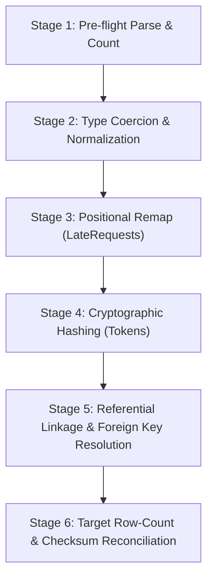

# Donatur Helper — XLSX to Supabase Schema Mapping Report

> **Document Type**: Technical Architecture & Migration Specification  
> **Status**: Approved for ETL Pipeline Development  
> **Date**: 18 August 2026  
> **Target Database**: Supabase PostgreSQL  
> **Source Artifacts**:  
> - Source Inventory: [`docs/reports/xlsx-data-inventory.json`](file:///C:/Users/oneda/Projects/Donatur%20Helper/docs/reports/xlsx-data-inventory.json)  
> - Source Report: [`docs/reports/xlsx-data-inventory.md`](file:///C:/Users/oneda/Projects/Donatur%20Helper/docs/reports/xlsx-data-inventory.md)  
> - Migration SQL: [`supabase/migrations/20260818000000_initial_schema.sql`](file:///C:/Users/oneda/Projects/Donatur%20Helper/supabase/migrations/20260818000000_initial_schema.sql)  

---

## 1. Executive Overview

This specification establishes the authoritative schema mapping and data transformation contract for migrating the **Donatur Helper** data model from legacy Google Sheets / XLSX into a normalized, hardened **Supabase PostgreSQL** instance.

### Core Architectural Decisions
1. **Surrogate UUID Primary Keys**: Every table uses `id UUID PRIMARY KEY DEFAULT gen_random_uuid()` to decouple internal relational integrity from mutable human-facing codes.
2. **Business Identifier Preservation**: Legacy business codes (`campaign_id`, `request_id`, etc.) are maintained as `TEXT NOT NULL UNIQUE` columns with indexed lookups to guarantee backwards compatibility with legacy links and APIs.
3. **Strict Credential Hashing**: Authentication tokens from the legacy `Tokens` sheet and `SUPER_ADMIN_TOKEN` are migrated strictly as one-way SHA-256 cryptographic hashes (`token_hash`) into `auth_tokens`. Plaintext token strings are **never** persisted in the database.
4. **Defensive Data Sanitation**: All WhatsApp phone numbers are canonicalized to the international **E.164** format (`+628...`), and status string enums are normalized to consistent uppercase values.
5. **Positional Data Repair for `LateRequests`**: A hardcoded positional transformer repairs the historical Google Sheets column misalignment where cell data was inserted out of order relative to header names.
6. **Exclusion of `Workaroundsz`**: The legacy scratch/dump tab `Workaroundsz` is omitted entirely from the database schema and ETL ingest.

---

## 2. XLSX Tab to Supabase Table Mapping

| Source XLSX Tab | Raw Rows | Data Rows | Target Supabase Table | Purpose / Description | Action |
| :--- | ---: | ---: | :--- | :--- | :--- |
| **`Settings`** | 7 | 6 | `app_settings` | Runtime parameters, feature flags, and system config | Migrate (Key-Value) |
| **`Members`** | 102 | 101 | `members` | Master directory of registered members & admins | Migrate (Normalized) |
| **`Tokens`** | 48 | 47 | `auth_tokens` | Role-based access tokens (hashed with SHA-256) | Migrate (Hashed) |
| **`Campaigns`** | 984 | 10 | `campaigns` | Donation events, targets, bank accounts, deadlines | Migrate (Filter empty rows) |
| **`Donors`** | 222 | 221 | `donors` | Individual pledges, split allocations, payment proof | Migrate (Relational) |
| **`LateRequests`** | 7 | 6 | `late_requests` | Post-deadline pledge requests awaiting PIC review | Migrate (Positional remap) |
| **`Workaroundsz`** | 78 | 77 | _(None)_ | Unstructured legacy administrator scratchpad | **EXCLUDE ENTIRELY** |
| _(New Table)_ | — | — | `reminder_logs` | Audit log for email notifications & Resend deliveries | New System Table |
| _(New Table)_ | — | — | `audit_logs` | System mutation audit trail & administrative logs | New System Table |

---

## 3. Detailed Column-by-Column Mappings

### 3.1 `Settings` → `app_settings`
- **Primary Key**: `key TEXT PRIMARY KEY`
- **Target Table**: `app_settings`

| XLSX Column | Target Column | Target Type | Nullable | Transformation / Normalization Rule |
| :--- | :--- | :--- | :---: | :--- |
| `Key` | `key` | `TEXT` | No | `trim()`. Serves as primary key (e.g. `AppUrl`, `EnableRounding`). |
| `Value` | `value` | `JSONB` | No | Parse into JSONB: booleans to `true`/`false`, numbers to numeric JSON, strings to JSON strings. |
| _(Generated)_ | `description` | `TEXT` | Yes | Descriptive documentation of the configuration key. |
| _(Generated)_ | `is_secret` | `BOOLEAN` | No | `TRUE` if key holds sensitive credentials/folder IDs; defaults to `FALSE`. |
| _(Generated)_ | `updated_at` | `TIMESTAMPTZ` | No | `NOW()` during migration. |

---

### 3.2 `Members` → `members`
- **Primary Key**: `id UUID PRIMARY KEY DEFAULT gen_random_uuid()`
- **Target Table**: `members`
- **Unique Constraint**: `whatsapp UNIQUE`

| XLSX Column | Target Column | Target Type | Nullable | Transformation / Normalization Rule |
| :--- | :--- | :--- | :---: | :--- |
| _(Generated)_ | `id` | `UUID` | No | `gen_random_uuid()`. |
| `Name` | `name` | `TEXT` | No | `String(Name).trim()`. |
| `WhatsApp` | `whatsapp` | `TEXT` | No | Canonical E.164 normalization (`+628...`). |
| `Email` | `email` | `TEXT` | Yes | `String(Email).trim().toLowerCase()` or `NULL` if empty. |
| `Status` | `status` | `TEXT` | No | Upper-cased: `ACTIVE`, `PENDING`, `REJECTED`, `DELETED`, `EX`. Default `'ACTIVE'`. |
| `Role` | `role` | `TEXT` | No | Upper-cased: `MEMBER`, `ADMIN`, `SUPER_ADMIN`. Default `'MEMBER'`. |
| `AddedBy` | `added_by` | `TEXT` | Yes | `String(AddedBy).trim()`. |
| `AddedAt` | `added_at` | `TIMESTAMPTZ` | Yes | ISO parse with `+07:00` WIB offset. |
| `ModifiedBy` | `modified_by` | `TEXT` | Yes | `String(ModifiedBy).trim()` or `NULL`. |
| `ModifiedAt` | `modified_at` | `TIMESTAMPTZ` | Yes | ISO parse with `+07:00` WIB offset or `NULL`. |

---

### 3.3 `Campaigns` → `campaigns`
- **Primary Key**: `id UUID PRIMARY KEY DEFAULT gen_random_uuid()`
- **Target Table**: `campaigns`
- **Unique Constraint**: `campaign_id UNIQUE`

| XLSX Column | Target Column | Target Type | Nullable | Transformation / Normalization Rule |
| :--- | :--- | :--- | :---: | :--- |
| _(Generated)_ | `id` | `UUID` | No | `gen_random_uuid()`. |
| `CampaignID` | `campaign_id` | `TEXT` | No | `String(CampaignID).trim()` (e.g. `C-04674E2E`). Filter empty rows. |
| `TargetName` | `target_name` | `TEXT` | No | `String(TargetName).trim()`. |
| `Reason` | `reason` | `TEXT` | Yes | `String(Reason).trim()`. |
| `GiftAmount` | `gift_amount` | `NUMERIC(12,2)` | No | `Number(GiftAmount) || 0`. |
| `Status` | `status` | `TEXT` | No | Upper-cased: `OPEN`, `FINALIZED`, `ARCHIVED`, `CLOSED`. Default `'OPEN'`. |
| `StartDate` | `start_date` | `TIMESTAMPTZ` | Yes | ISO parse with `+07:00` WIB offset or `NULL`. |
| `Deadline` | `deadline` | `TIMESTAMPTZ` | Yes | ISO parse with `+07:00` WIB offset. |
| `BankName` | `bank_name` | `TEXT` | Yes | `String(BankName).trim()` (e.g. `BCA`, `Gopay`). |
| `BankAccount` | `bank_account` | `TEXT` | Yes | String cast of numbers/text, trimmed. |
| `AccountHolder` | `account_holder` | `TEXT` | Yes | `String(AccountHolder).trim()`. |
| `RoundingUsed` | `rounding_used` | `BOOLEAN` | No | Boolean cast: `true`/`false`. Default `FALSE`. |
| `RoundTo` | `round_to` | `INTEGER` | No | Integer parse: default `500`. |
| `GiftLink` | `gift_link` | `TEXT` | Yes | `String(GiftLink).trim()` or `NULL`. |
| `GiftImage` | `gift_image` | `TEXT` | Yes | `String(GiftImage).trim()` or `NULL`. |
| `CreatedAt` | `created_at` | `TIMESTAMPTZ` | No | ISO parse with `+07:00` WIB offset. Default `NOW()`. |
| `FinalizedAt` | `finalized_at` | `TIMESTAMPTZ` | Yes | ISO parse with `+07:00` WIB offset or `NULL`. |
| `ModifiedBy` | `modified_by` | `TEXT` | Yes | `String(ModifiedBy).trim()` or `NULL`. |
| `ModifiedAt` | `modified_at` | `TIMESTAMPTZ` | Yes | ISO parse with `+07:00` WIB offset or `NULL`. |

---

### 3.4 `Tokens` → `auth_tokens`
- **Primary Key**: `id UUID PRIMARY KEY DEFAULT gen_random_uuid()`
- **Target Table**: `auth_tokens`
- **Unique Constraint**: `token_hash UNIQUE`
- **Security Rule**: Do **NOT** store plaintext `TokenID`. Store cryptographic hash only.

| XLSX Column | Target Column | Target Type | Nullable | Transformation / Normalization Rule |
| :--- | :--- | :--- | :---: | :--- |
| _(Generated)_ | `id` | `UUID` | No | `gen_random_uuid()`. |
| `TokenID` | `token_hash` | `TEXT` | No | `crypto.createHash('sha256').update(TokenID.trim()).digest('hex')`. |
| `Role` | `role` | `TEXT` | No | Upper-cased: `SUPER_ADMIN`, `ADMIN`, `PIC`. |
| `Status` | `status` | `TEXT` | No | Upper-cased: `ACTIVE`, `EXPIRED`, `UNUSED`, `REVOKED`. Default `'ACTIVE'`. |
| `LinkedCampaignID` | `linked_campaign_id` | `TEXT` | Yes | FK to `campaigns(campaign_id)`. Set `NULL` if target campaign not found. |
| `Alias` | `alias` | `TEXT` | Yes | `String(Alias).trim()` or `NULL`. |
| `CreatedBy` | `created_by` | `TEXT` | Yes | `String(CreatedBy).trim()`. |
| `CreatedAt` | `created_at` | `TIMESTAMPTZ` | No | ISO parse with `+07:00` WIB offset. Default `NOW()`. |
| _(Generated)_ | `expires_at` | `TIMESTAMPTZ` | Yes | `NULL` (or calculated policy if required). |
| _(Generated)_ | `revoked_at` | `TIMESTAMPTZ` | Yes | `NULL` (or `NOW()` if status is `REVOKED`). |
| _(Generated)_ | `last_used_at` | `TIMESTAMPTZ` | Yes | `NULL`. |

---

### 3.5 `Donors` → `donors`
- **Primary Key**: `id UUID PRIMARY KEY DEFAULT gen_random_uuid()`
- **Target Table**: `donors`
- **Unique Constraint**: `(campaign_id, whatsapp) UNIQUE`
- **Foreign Keys**: `campaign_id REFERENCES campaigns(campaign_id) ON DELETE CASCADE`, `member_id REFERENCES members(id) ON DELETE SET NULL`

| XLSX Column | Target Column | Target Type | Nullable | Transformation / Normalization Rule |
| :--- | :--- | :--- | :---: | :--- |
| _(Generated)_ | `id` | `UUID` | No | `gen_random_uuid()`. |
| `CampaignID` | `campaign_id` | `TEXT` | No | `String(CampaignID).trim()`. Validated against `campaigns`. |
| _(Lookup)_ | `member_id` | `UUID` | Yes | Lookup `members.id` via normalized WhatsApp phone. Set `NULL` if unlinked. |
| `Name` | `name` | `TEXT` | No | `String(Name).trim()`. |
| `WhatsApp` | `whatsapp` | `TEXT` | No | Canonical E.164 normalization (`+628...`). |
| `Alias` | `alias` | `TEXT` | Yes | `String(Alias).trim()` or `NULL`. |
| `DonorStatus` | `donor_status` | `TEXT` | No | Upper-cased: `PLEDGED`, `WITHDRAWN`, `CANCELLED`. Default `'PLEDGED'`. |
| `AmountDue` | `amount_due` | `NUMERIC(12,2)` | No | `Number(AmountDue) || 0`. |
| `CustomAmount` | `custom_amount` | `NUMERIC(12,2)` | Yes | `Number(CustomAmount)` or `NULL`. |
| `AmountPaid` | `amount_paid` | `NUMERIC(12,2)` | No | `Number(AmountPaid) || 0`. |
| `Paid` | `paid` | `BOOLEAN` | No | Boolean cast (`TRUE`/`FALSE`). Default `FALSE`. |
| `ProofLink` | `proof_link` | `TEXT` | Yes | Retain existing Google Drive URL in Phase 1. |
| _(Generated)_ | `proof_storage_path` | `TEXT` | Yes | `NULL` for legacy records; reserved for Supabase Storage paths. |
| `PaidAt` | `paid_at` | `TIMESTAMPTZ` | Yes | ISO parse with `+07:00` WIB offset or `NULL`. |
| `Verified` | `verified` | `BOOLEAN` | No | Boolean cast (`TRUE`/`FALSE`). Default `FALSE`. |
| `Refunded` | `refunded` | `BOOLEAN` | No | Boolean cast (`TRUE`/`FALSE`). Default `FALSE`. |
| `JoinedAt` | `joined_at` | `TIMESTAMPTZ` | No | ISO parse with `+07:00` WIB offset. Default `NOW()`. |
| `LastReminderSentAt` | `last_reminder_sent_at` | `TIMESTAMPTZ` | Yes | ISO parse with `+07:00` WIB offset or `NULL`. |
| `ModifiedBy` | `modified_by` | `TEXT` | Yes | `String(ModifiedBy).trim()` or `NULL`. |
| `ModifiedAt` | `modified_at` | `TIMESTAMPTZ` | Yes | ISO parse with `+07:00` WIB offset or `NULL`. |

---

### 3.6 `LateRequests` → `late_requests` (Positional Remapping)
- **Primary Key**: `id UUID PRIMARY KEY DEFAULT gen_random_uuid()`
- **Target Table**: `late_requests`
- **Unique Constraint**: `request_id UNIQUE`
- **Foreign Key**: `campaign_id REFERENCES campaigns(campaign_id) ON DELETE CASCADE`

| XLSX Col Index | Header in XLSX | Actual Data Content | Target Column | Target Type | Normalization & Repair Rule |
| :---: | :--- | :--- | :--- | :--- | :--- |
| **0** | `RequestID` | `"REQ-389AF9CE"` | `request_id` | `TEXT` | `String(col[0]).trim()` |
| **1** | `CampaignID` | `"C-04674E2E"` | `campaign_id` | `TEXT` | `String(col[1]).trim()` |
| **2** | `PIC_Alias` | `"ADM-****"` | `pic_alias` | `TEXT` | `String(col[2]).trim()` |
| **3** | `DonorWhatsApp` | `"Mirda"` *(Name)* | **`donor_name`** | `TEXT` | Extract from **Index 3** |
| **4** | `DonorName` | `628123456789` *(Phone)* | **`donor_whatsapp`** | `TEXT` | Extract from **Index 4** & normalize to E.164 (`+628...`) |
| **5** | `DonorAlias` | `true` *(IsCustom)* | **`is_custom`** | `BOOLEAN` | Extract from **Index 5** (`Boolean(col[5])`) |
| **6** | `Reason` | `2000000` *(Amount)* | **`custom_amount`** | `NUMERIC(12,2)` | Extract from **Index 6** (`Number(col[6])`) |
| **7** | `IsCustom` | `"Kelupaan"` *(Reason)* | **`reason`** | `TEXT` | Extract from **Index 7** |
| **8** | `CustomAmount` | `"Rejected"` *(Status)* | **`status`** | `TEXT` | Extract from **Index 8**, normalize to uppercase (`REJECTED`, `APPROVED`, etc.) |
| **9** | `Status` | `2026-06-13` *(Timestamp)* | **`created_at`** | `TIMESTAMPTZ` | Extract from **Index 9**, parse timestamp with `+07:00` WIB offset |
| **10** | `CreatedAt` | `null` | _(Ignored)_ | — | Column 10 is completely blank across all rows. |

---

## 4. Status & Enum Normalization Rules

All legacy status codes are stored with inconsistent casings in Google Sheets (`active`, `Pending`, `Pledged`, `Open`, `Rejected`). The ETL script must normalize all values to canonical uppercase tokens before database insertion:

```
┌─────────────────┐       ┌────────────────────────┐       ┌──────────────────────────────┐
│  Source String  │ ────► │ .trim().toUpperCase()  │ ────► │  Postgres CHECK Constraints  │
└─────────────────┘       └────────────────────────┘       └──────────────────────────────┘
```

### Normalization Matrix:
- **`members.status`**: `'active'` → `'ACTIVE'`, `'pending'` → `'PENDING'`, `'rejected'` → `'REJECTED'`, `'deleted'` → `'DELETED'`, `'ex'` → `'EX'`
- **`members.role`**: `'admin'` → `'ADMIN'`, `'member'` → `'MEMBER'`, `'super_admin'` → `'SUPER_ADMIN'`
- **`campaigns.status`**: `'open'` → `'OPEN'`, `'finalized'` → `'FINALIZED'`, `'archived'` → `'ARCHIVED'`, `'closed'` → `'CLOSED'`
- **`auth_tokens.role`**: `'admin'` → `'ADMIN'`, `'pic'` → `'PIC'`, `'super_admin'` → `'SUPER_ADMIN'`
- **`auth_tokens.status`**: `'active'` → `'ACTIVE'`, `'expired'` → `'EXPIRED'`, `'unused'` → `'UNUSED'`, `'revoked'` → `'REVOKED'`
- **`donors.donor_status`**: `'pledged'` → `'PLEDGED'`, `'withdrawn'` → `'WITHDRAWN'`, `'cancelled'` → `'CANCELLED'`
- **`late_requests.status`**: `'pending'` → `'PENDING'`, `'approved'` → `'APPROVED'`, `'rejected'` → `'REJECTED'`, `'duplicate'` → `'DUPLICATE'`

---

## 5. Phone Number Normalization Rule (E.164)

Legacy phone numbers exist in multiple heterogeneous representations (integers, strings starting with `08`, `628`, `+62`, or containing non-printable Unicode characters like `\u202C`).

### Canonical Transformation Function:
```javascript
export function normalizeWhatsApp(raw) {
  if (!raw) return null;
  // 1. Convert to string and remove all non-numeric characters (including invisible unicode)
  let clean = String(raw).replace(/\D/g, '');
  
  // 2. Strip leading zeroes (e.g. 0812... -> 812...)
  clean = clean.replace(/^0+/, '');
  
  // 3. Strip leading country code 62 if already present
  if (clean.startsWith('62')) {
    clean = clean.slice(2);
  }
  
  // 4. Prepend international country code prefix (+62)
  return `+62${clean}`;
}
```

### Examples:
- `8121015734` → `+628121015734`
- `08112002122` → `+628112002122`
- `6285161289889` → `+6285161289889`
- `" 08112002122\u202C "` → `+628112002122`

---

## 6. Workaroundsz Tab Disposition

- **Finding**: The `Workaroundsz` sheet contains 77 rows and 34 columns, with 18 unlabelled columns (`__EMPTY_COL_1` to `__EMPTY_COL_18`) and duplicate copies of donor rows created during Google Apps Script manual hotfixing.
- **Architectural Disposition**:
  - **No table** is created in Supabase PostgreSQL for `Workaroundsz`.
  - The ETL migration script will completely skip the `Workaroundsz` sheet during data ingestion.
  - Zero data loss occurs because all legitimate donor records are sourced cleanly from the primary `Donors` sheet.

---

## 7. Orphan Handling & Referential Integrity Strategy

| Foreign Key Relationship | Inventory Result | Orphan Count | Migration & ETL Strategy |
| :--- | :---: | :---: | :--- |
| **`donors.campaign_id` → `campaigns.campaign_id`** | 221 / 221 (100%) | 0 | Hard foreign key constraint with `ON DELETE CASCADE`. |
| **`late_requests.campaign_id` → `campaigns.campaign_id`** | 6 / 6 (100%) | 0 | Hard foreign key constraint with `ON DELETE CASCADE`. |
| **`auth_tokens.linked_campaign_id` → `campaigns.campaign_id`** | 11 / 15 (73.3%) | 4 | Nullable foreign key with `ON DELETE SET NULL`. If `LinkedCampaignID` does not exist in `campaigns`, set `linked_campaign_id = NULL` during ETL. |
| **`donors.member_id` → `members.id`** | 220 / 221 (99.5%) | 1 | Match `donors.whatsapp` against `members.whatsapp`. If matched, set `member_id = members.id`. For the 1 orphan (legacy dummy test phone `628123`), leave `member_id = NULL` while retaining the donor row and contact name in `donors`. |

---

## 8. Secret & Credential Handling Strategy

### 8.1 Plaintext Token Proscription
- **Rule**: Plaintext token IDs (`SA-XXXX`, `TOK-XXXX`, `PIC-XXXX`) must **never** be stored in the database.
- **Implementation**: The ETL pipeline transforms every `TokenID` into `SHA-256(TokenID.trim())` before saving into `auth_tokens.token_hash`.
- **Lookup Flow**: Client requests presenting `?token=...` are verified via Supabase Edge Function or Postgres RPC `verify_auth_token(p_token)` by hashing the supplied parameter and performing a constant-time equality check on `auth_tokens.token_hash`.

### 8.2 Application Settings & Super Admin Secrets
- `app_settings.is_secret` flag isolates sensitive keys (e.g. Google Drive folder IDs, webhook secrets).
- Row Level Security (RLS) restricts access to `app_settings` where `is_secret = true` exclusively to the `service_role` (Edge Functions and backend workers).

---

## 9. Recommended ETL Validation Checks

Before committing migrated data to production, the ETL script must execute these automated validation gates:



### Validation Gates:
1. **Pre-flight Row Counts**:
   - `Settings`: Exactly 6 rows.
   - `Members`: Exactly 101 rows.
   - `Tokens`: Exactly 47 rows.
   - `Campaigns`: Exactly 10 rows (excluding 973 trailing empty rows).
   - `Donors`: Exactly 221 rows.
   - `LateRequests`: Exactly 6 rows.
2. **Phone Number E.164 Invariant**: 100% of non-null phone numbers in `members`, `donors`, and `late_requests` must match regex `^\+628\d{7,13}$`.
3. **No Plaintext Token Leakage**: 100% of values in `auth_tokens.token_hash` must be 64-character lowercase hexadecimal strings (`/^[a-f0-9]{64}$/`).
4. **Referential Integrity Validation**: Zero foreign key violations when executing insert transactions in topological order: `app_settings` → `members` → `campaigns` → `auth_tokens` → `donors` → `late_requests`.
5. **Idempotency**: Re-running the ETL script in `--dry-run` or against a fresh schema must produce identical row counts and checksums.

---

## 10. Open Questions for Final Human Sign-off

The following operational questions should be reviewed before executing the live data migration:

1. **Payment Proof Assets Migration Timeline**:
   - Existing records retain legacy Google Drive URLs in `donors.proof_link`.
   - *Question*: Should existing files on Google Drive be batch-downloaded and re-uploaded to Supabase Storage bucket `bukti-transfer` in Phase 1, or should new uploads use Supabase Storage while legacy records retain Drive links? *(Recommended: Phase 1 retain links, Phase 2 asset copy)*.
2. **Orphan Member Record for Dummy Donor (`628123`)**:
   - 1 legacy test donor entry has a dummy phone number `628123`.
   - *Question*: Confirm leaving `member_id = NULL` rather than creating a synthetic placeholder member in `members`? *(Recommended: Leave `member_id = NULL`)*.
3. **Admin Authentication Transition**:
   - Current tokens are migrated as SHA-256 hashes into `auth_tokens`.
   - *Question*: Should administrative users migrate to Supabase Auth email/password logins in parallel with token authentication? *(Recommended: Enable both via Edge Function verification)*.

---

*Report prepared and validated for the Donatur Helper Database Migration Pipeline.*
